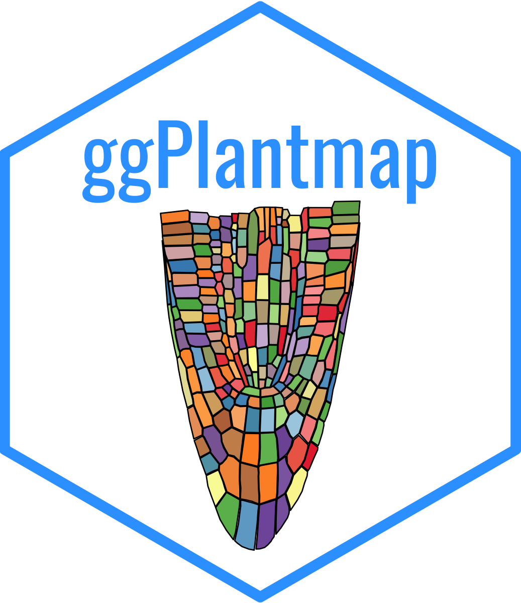
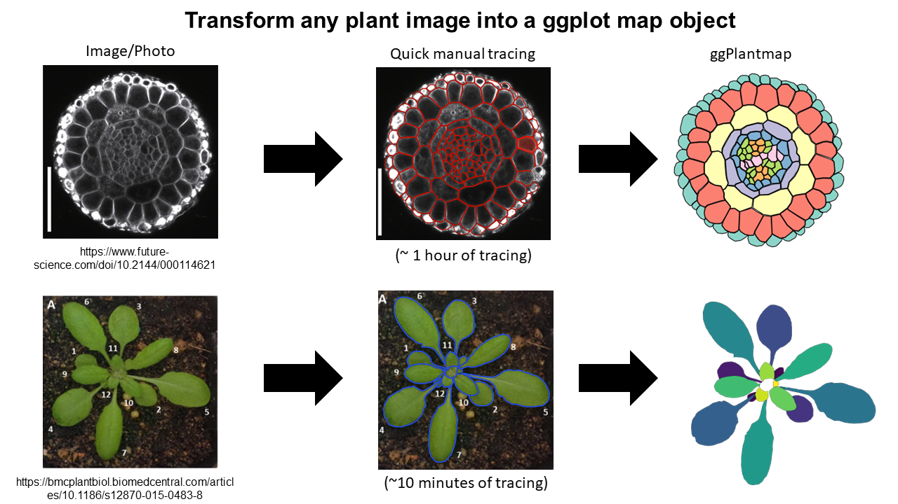
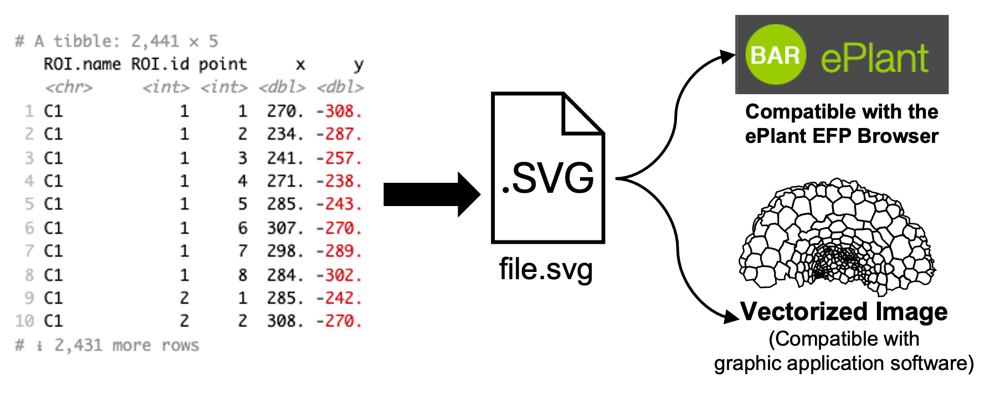

```{r, echo = FALSE}
knitr::opts_chunk$set(
  collapse = TRUE,
  comment = "#>",
  fig.path = "man/figures/README-"
)
```

# ggPlantmap 
###### Version 1.1.0
###### Author: Leonardo Jo (l.jo@uu.nl)

<!-- badges: start -->
<!-- badges: end -->

## Overview

  ggPlantmap is an open-source R package with the goal of facilitating the generation of informative ggplot maps from plant images to explore quantitative cell-type specific data. When combined with external quantitative data, ggPlantmap can be used for the visualization and displaying of spatial profiles in distinct parts/cells of the plant. 

  Included in the package there is a set of pre-loaded maps created from previously published plant images that can be directly inserted into a ggplot coding workflow. ggPlantmap enables users to plot heatmap signatures of gene expression or any spatial quantitative data onto plant images providing a customizable and extensible platform for visualizing, and analyzing spatial quantitative patterns within specific plant regions This package uses the flexibility of the well-known ggplot2 R package to allow users to tailor maps to their specific research questions.


## Installation

```{r, eval = FALSE}
##install devtools (if you haven't already)
install.packages("devtools")
library(devtools)

## Installing from a github respository
install_github("leonardojo/ggPlantmap")
```


## ggPlantmap useful guides (HIGHLY RECOMMENDED!)

**(NEW)** Here is a [practical guide](https://github.com/leonardojo/ggPlantmap/blob/main/guides/guide_practical_sc.md) on how to work with ggPlantmap to explore single-cell data

I created a step-by-step [user guide](https://github.com/leonardojo/ggPlantmap/blob/main/guides/ggPlantmap.userguide.md) to help users navigate through the package. 

Here is a recorded [seminar](https://www.youtube.com/watch?v=TD5m5-CbWTw&t=1402s) with an overview of the package.

I also created a [step-by-step guide with tips](https://github.com/leonardojo/ggPlantmap/blob/main/guides/TutorialforXMLfile.pdf) on how to create your own ggPlantmap.

Finally, here are some [instructions](https://github.com/leonardojo/ggPlantmap/blob/main/guides/contributetoggPlantmap.md) on how your newly created ggPlantmap can be included in the package.

## What is a ggPlantmap?

Each unique ggPlantmap is a table (tibble) object with points coordinates (x,y) of specific points of polygons (ROIs) extracted from plant images.
```{r}
library(ggPlantmap)
head(ggPm.At.roottip.longitudinal)
```


## Plotting a ggPlantmap

ggPlantmaps can be easily plotted using the ggPlantmap.plot() function.
```{r,warning=F,echo=T,out.width="50%",fig.align="center"}
library(ggPlantmap)
ggPlantmap.plot(ggPm.At.earlyembryogenesis.devseries,Cell)
ggPlantmap.plot(ggPm.At.roottip.longitudinal,Level1)
```

## Pre-loaded ggPlantmaps
The package contain a series of pre-loaded ggPlantmaps created from previously published plant images.
I hope to update the package with the contribution of the plant research community.

```{r}
library(ggPlantmap)
ggPm.summary
```


## Color mapping
These maps can be easily loaded into a ggplot coding environment and their color mapping changed based on the distinct layer classification of each ggPlantmap.

```{r,warning=F,echo=F,out.width="50%",fig.align="center"}
library(ggplot2)
library(cowplot)
## Stage: Seed development stage
## Part: Distinct parts of a seed (Seed coat, Endosperm and Embryo)
## Region: Specific regions of each part of the Arabidopsis seed
## Reference: Belmonte, Mark F., et al. "Comprehensive developmental profiles of gene activity in regions and subregions of the Arabidopsis seed." Proceedings of the National Academy of Sciences 110.5 (2013): E435-E444.
a <- ggPlantmap.plot(ggPm.At.seed.devseries,Region,linewidth = 0.5) +
  scale_fill_brewer(palette="Set3") +
  ggtitle("Regions of Arabidopsis seed development") +
   theme(legend.key.height= unit(0.25, 'cm'),
        legend.key.width= unit(0.25, 'cm'))
b <- ggPlantmap.plot(ggPm.At.seed.devseries,Stage,linewidth = 0.5) +
  scale_fill_brewer(palette="Set1") +
  ggtitle("Stages of Arabidopsis seed development") +
   theme(legend.key.height= unit(0.25, 'cm'),
        legend.key.width= unit(0.25, 'cm'))
c <- ggPlantmap.plot(ggPm.At.seed.devseries,Part,linewidth = 0.5) +
  scale_fill_brewer(palette="Set1") +
  ggtitle("Parts of Arabidopsis seed development") +
   theme(legend.key.height= unit(0.25, 'cm'),
        legend.key.width= unit(0.25, 'cm'))
plot_grid(a,b,c,ncol=1,labels=c("a","b","c"),align = "v")
```

```{r,warning=F,echo=F,out.width="50%",fig.align="center"}
library(ggPlantmap)
library(ggplot2)
library(cowplot)
a <- ggPlantmap.plot(ggPm.At.shootapex.longitudinal,Zone) +
  scale_fill_brewer(palette="Set2") +
    ggtitle("Shoot Apical Meristem - Zones") +
   theme(legend.key.height= unit(0.25, 'cm'),
        legend.key.width= unit(0.25, 'cm'))
b <- ggPlantmap.plot(ggPm.At.shootapex.longitudinal,Layer) +
  scale_fill_brewer(palette="YlGn") +
  ggtitle("Shoot Apical Meristem - Layers") +
   theme(legend.key.height= unit(0.25, 'cm'),
        legend.key.width= unit(0.25, 'cm'))
plot_grid(a,b,ncol=1,labels=c("d","e"),align = "v")
```


## Overlaying external quantitative data into a ggPlantmap

  With ggPlantmap you can overlay quantitative data into your ggPlantmap to visualize it as sort of a heatmap.
To do so, you will need another table that contains quantitative data attributed to your ROIs.
<br />

This approach can be very helpful for R Shiny app developers to create web interactive tools to visualize quantitative data in plant cell or structures.

Some examples of heatmaps generated from available published data:
<br />
<br />


## Is ggPlantmap only usefull for molecular expression data?

Not at all. ggPlantmap can also be used to produce many other type of plots. Essentially anything that you can trace, you can create! Be creative! I hope to build a community where people explore the usage of ggPlantmap for the communication of Plant science. 

<br />


## How can I create my own ggPlantmap?

The principle of creating a ggPlantmap is fairly simple. We generate a list of ROIs (region of interests) in the Icy open-source software (https://icy.bioimageanalysis.org/) from any plant image. These ROIs are saved as XML files and later be converted into ggPlantmaps with the XML.to.ggPlantmap() function.
[We created step-by-step guide with tips](https://github.com/leonardojo/ggPlantmap/blob/main/TutorialforXMLfile.pdf) on how to generate xml images from plant images.



```{r,out.width="50%"}
new.ggPlantmap <- XML.to.ggPlantmap("data/ggPm.sample.xml")
ggPlantmap.plot(new.ggPlantmap,ROI.name)
```

## Can my ggPlantmap be included in the package?

YES!!! Any Plant map can be included in the package. 
Here are some [instructions](https://github.com/leonardojo/ggPlantmap/blob/main/contributetoggPlantmap.md) on how your newly created ggPlantmap can be included in the package. 

If you create one, please email me (l.jo@uu.nl) your ggPlantmap as tab-delimited table and I'll make sure to include in the package. You will be credited and your information will be displayed in the summary file. I really hope this becomes an organic package with the contribution of the plant research community.


## Can my ggPlantmap be integrated into an ePlant EFP browser or any other graphical software?

YES!! You can convert your ggPlantmap table into an SVG file that can be used 


```{r}
ggPlantmap.to.SVG(ggPm.At.3weekrosette.topview,
                  group.name = "ROI.name",
                  author = "ggPlantmap",
                  svg.name="ggPlantmap.svg")
## This will create an image file (.svg) that can be opened in an graphic software (Illustrator, Power-Point)
```


## Acknowledgements

I would like to acknowledge Kaisa Kajala, Lisa Oskam, Monica Garcia Gomez, Pierre Gautrat and Kyra van der Velde for testing ggPlantmap. I also would like to acknowledge Andres Romanowski for providing some data for the initial tests of ggPlantmap.

## How to cite
### Pre-print

(current version) Leonardo Jo, Kaisa Kajala. ggPlantmap: an R package for creation of informative and quantitative ggplot maps derived from plant images.
bioRxiv 2023.11.30.569429; doi: https://doi.org/10.1101/2023.11.30.569429

(previous version) Leonardo Jo, Kaisa Kajala. ggPlantmap: an R package for the  graphic mapping of plant images. Authorea. September 21, 2023.
DOI: 10.22541/au.169531385.58441696/v1


