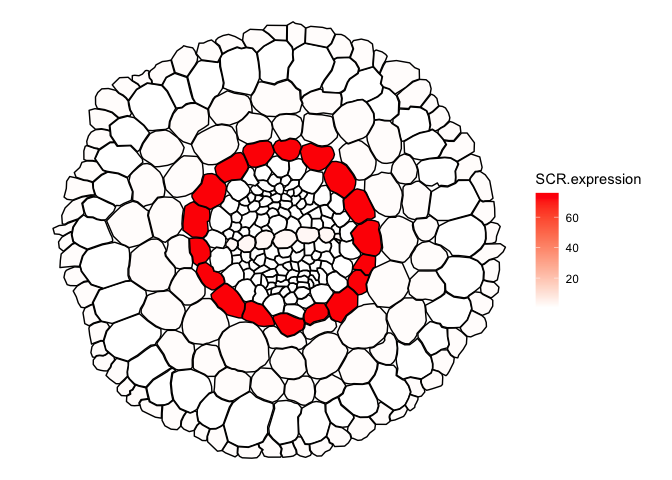
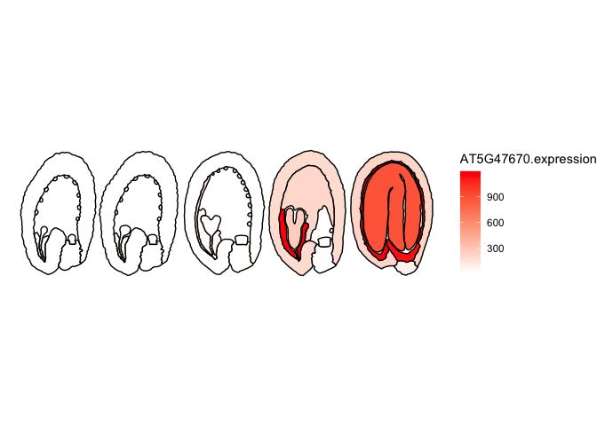

# ggPlantmap 

###### Version Beta.1

<!-- badges: start -->
<!-- badges: end -->

## Overview

ggPlantmap is a R tidyverse based package with a series of plant images
to be mapped in a ggplot enviroment. We also provide a series of
functions and instructions to easily create your own personal
ggPlantmap. These ggPlantmap objects can be added into R pipelines for
the visual representation of quantitative data in distinct plant cells
and/or structures.


## Installation

``` r
##install devtools (if you haven't already)
install.packages("devtools")
library(devtools)

## Installing from a github respository
install_github("leonardojo/ggPlantmap")
```

## What is a ggPlantmap?

Each unique ggPlantmap is a table (tibble) object with points
coordinates (x,y) of specific polygons extracted from plant images.

``` r
library(ggPlantmap)
head(ggPm.At.roottip.longitudinal)
#> # A tibble: 6 × 7
#>   ROI.name    Level1   Level2 ROI.id point     x     y
#>   <chr>       <chr>    <chr>   <int> <int> <dbl> <dbl>
#> 1 Meristem.QC Meristem QC          1     1  121. -323.
#> 2 Meristem.QC Meristem QC          1     2  127. -315.
#> 3 Meristem.QC Meristem QC          1     3  134. -315.
#> 4 Meristem.QC Meristem QC          1     4  149. -318.
#> 5 Meristem.QC Meristem QC          1     5  149. -329.
#> 6 Meristem.QC Meristem QC          1     6  134. -327.
```

## Where can I find the list of all ggPlantmaps objects?

The whole list of pre-loaded ggPlantmap objects can be found in the
table ggPm.summary. You can find the description of ggPlantmaps, as well
as information of its creator. Because most ggPlantmaps are based on
previously published plant images, the references for each specific
image can also be found in the summary table. We hope to keep updating
the ggPlantmap catalog, with the help of the plant research community.
</a>

``` r
head(ggPm.summary)
#> # A tibble: 6 × 9
#>   ggPlantmap.name    Species Tissue Type  Descr…¹ Layers Image…² Made.by Conta…³
#>   <chr>              <chr>   <chr>  <chr> <chr>   <chr>  <chr>   <chr>   <chr>  
#> 1 ggPm.At.roottip.c… Arabid… root   cros… Cross-… Cells  https:… Leonar… jo.leo…
#> 2 ggPm.At.roottip.l… Arabid… root   long… Longit… Cells  https:… Leonar… jo.leo…
#> 3 ggPm.At.3weekrose… Arabid… roset… top … Top vi… Leaves https:… Leonar… jo.leo…
#> 4 ggPm.At.leafepide… Arabid… leaf … top … Top vi… Cells  https:… Leonar… jo.leo…
#> 5 ggPm.At.leaf.cros… Arabid… leaves cros… Cross-… Cells  https:… Leonar… jo.leo…
#> 6 ggPm.At.seed.devs… Arabid… seed   deve… Diagra… Cells… https:… Leonar… jo.leo…
#> # … with abbreviated variable names ¹​Description, ²​Image.Reference,
#> #   ³​Contact.Info

##Listing all the ggPlantmap objects
ggPm.summary$ggPlantmap.name
#>  [1] "ggPm.At.roottip.crosssection"         
#>  [2] "ggPm.At.roottip.longitudinal"         
#>  [3] "ggPm.At.3weekrosette.topview"         
#>  [4] "ggPm.At.leafepidermis.topview"        
#>  [5] "ggPm.At.leaf.crosssection"            
#>  [6] "ggPm.At.seed.devseries"               
#>  [7] "ggPm.At.earlyembryogenesis.devseries" 
#>  [8] "ggPm.At.shootapex.longitudinal"       
#>  [9] "ggPm.At.inflorescencestem.crossection"
#> [10] "ggPm.Sl.root.crossection"             
#> [11] "ggPm.At.leaf.topview"                 
#> [12] "ggPm.At.rootelong.longitudinal"       
#> [13] "ggPm.At.rootmatur.crosssection"       
#> [14] "ggPm.At.flower.diagram"               
#> [15] "ggPm.At.lateralroot.devseries"        
#> [16] "ggPm.Ms.root.crosssection"
```

## General usage

All ggPlantmaps are pre-loaded in the package, you can call them
directly in your R environment by typing their name.

``` r
library(ggPlantmap)
##examples
ggPm.At.roottip.longitudinal
#> # A tibble: 1,541 × 7
#>    ROI.name    Level1   Level2 ROI.id point     x     y
#>    <chr>       <chr>    <chr>   <int> <int> <dbl> <dbl>
#>  1 Meristem.QC Meristem QC          1     1  121. -323.
#>  2 Meristem.QC Meristem QC          1     2  127. -315.
#>  3 Meristem.QC Meristem QC          1     3  134. -315.
#>  4 Meristem.QC Meristem QC          1     4  149. -318.
#>  5 Meristem.QC Meristem QC          1     5  149. -329.
#>  6 Meristem.QC Meristem QC          1     6  134. -327.
#>  7 Meristem.QC Meristem QC          2     1  150. -330.
#>  8 Meristem.QC Meristem QC          2     2  150. -318.
#>  9 Meristem.QC Meristem QC          2     3  156. -317.
#> 10 Meristem.QC Meristem QC          2     4  164. -316.
#> # … with 1,531 more rows
ggPm.At.roottip.crosssection
#> # A tibble: 1,408 × 5
#>    ROI.name  ROI.id point     x     y
#>    <chr>      <int> <int> <dbl> <dbl>
#>  1 Epidermis      1     1  156. -333.
#>  2 Epidermis      1     2  167. -332.
#>  3 Epidermis      1     3  177. -340.
#>  4 Epidermis      1     4  176. -380.
#>  5 Epidermis      1     5  173. -384.
#>  6 Epidermis      1     6  165. -387.
#>  7 Epidermis      1     7  157. -387.
#>  8 Epidermis      1     8  145. -381.
#>  9 Epidermis      1     9  142. -377.
#> 10 Epidermis      1    10  138. -371.
#> # … with 1,398 more rows
ggPm.Ms.root.crosssection
#> # A tibble: 2,441 × 5
#>    ROI.name ROI.id point     x     y
#>    <chr>     <int> <int> <dbl> <dbl>
#>  1 C1            1     1  270. -308.
#>  2 C1            1     2  234. -287.
#>  3 C1            1     3  241. -257.
#>  4 C1            1     4  271. -238.
#>  5 C1            1     5  285. -243.
#>  6 C1            1     6  307. -270.
#>  7 C1            1     7  298. -289.
#>  8 C1            1     8  284. -302.
#>  9 C1            2     1  285. -242.
#> 10 C1            2     2  308. -270.
#> # … with 2,431 more rows
```

## How can I plot a ggPlantmap?

You can use the ggPlantmap.plot() function to quickly visualize your
ggPlantmap.

``` r
##ggPlantmap.plot(data,layer,linewidth=0.5,show.legend=T)
ggPlantmap.plot(ggPm.At.roottip.longitudinal,ROI.id,linewidth = 1,show.legend = F)
```


If you have experience with ggplot, you can feed your a ggPlantmap
object into a ggplot with the geom\_polygon() function.

``` r
library(ggplot2)
ggplot(ggPm.At.roottip.longitudinal,aes(x,y)) +
  geom_polygon(aes(group=ROI.id,fill=factor(ROI.id)),show.legend = F,colour="black",linewidth=1) +
  coord_fixed() ## important to keep the aspect ratio of the plot
```


## How can I colormap distinct layers of a ggPlantmap?

Because each polygon on ggPlantmap is characterized by specific levels
(examples: Region,Stage,Part), you can color map them individually. Just
specify the column you want to colormap in the layer option of the
function. ggPlantmap.plot() is based on ggplot so you can add specific
modifications to it using ggplot coding logic.

``` r
library(ggplot2)
library(cowplot)

head(ggPm.At.seed.devseries)
#> # A tibble: 6 × 8
#>   ROI.name                           Stage Part  Region ROI.id point     x     y
#>   <chr>                              <chr> <chr> <chr>   <int> <int> <dbl> <dbl>
#> 1 Preglobular.seedcoat.Distal Seed … Preg… seed… Dista…      1     1  277. -693.
#> 2 Preglobular.seedcoat.Distal Seed … Preg… seed… Dista…      1     2  280. -689.
#> 3 Preglobular.seedcoat.Distal Seed … Preg… seed… Dista…      1     3  280. -685.
#> 4 Preglobular.seedcoat.Distal Seed … Preg… seed… Dista…      1     4  285. -681.
#> 5 Preglobular.seedcoat.Distal Seed … Preg… seed… Dista…      1     5  286. -675.
#> 6 Preglobular.seedcoat.Distal Seed … Preg… seed… Dista…      1     6  286. -669.

## Stage: Seed development stage
## Part: Distinct parts of a seed (Seed coat, Endosperm and Embryo)
## Region: Specific regions of each part of the Arabidopsis seed
## Reference: Belmonte, Mark F., et al. "Comprehensive developmental profiles of gene activity in regions and subregions of the Arabidopsis seed." Proceedings of the National Academy of Sciences 110.5 (2013): E435-E444.

a <- ggPlantmap.plot(ggPm.At.seed.devseries,Region,linewidth = 0.5) +
  scale_fill_brewer(palette="Set3") +
  ggtitle("Regions of Arabidopsis seed development") +
   theme(legend.key.height= unit(0.25, 'cm'),
        legend.key.width= unit(0.25, 'cm'))
b <- ggPlantmap.plot(ggPm.At.seed.devseries,Stage,linewidth = 0.5) +
  scale_fill_brewer(palette="Set1") +
  ggtitle("Stages of Arabidopsis seed development") +
   theme(legend.key.height= unit(0.25, 'cm'),
        legend.key.width= unit(0.25, 'cm'))
c <- ggPlantmap.plot(ggPm.At.seed.devseries,Part,linewidth = 0.5) +
  scale_fill_brewer(palette="Set1") +
  ggtitle("Parts of Arabidopsis seed development") +
   theme(legend.key.height= unit(0.25, 'cm'),
        legend.key.width= unit(0.25, 'cm'))
plot_grid(a,b,c,ncol=1,labels=c("a","b","c"),align = "v")
```

<!-- -->

Each map will have their own classification. If you would like to adjust
or create your own classification, you can save the ggPlantmap as a
table and modify it on to mach the degree of separation you want to
show.

## How can I create my own ggPlantmap?

The principle of creating a ggPlantmap is fairly simple. We generate a
list of ROIs (region of interests) in the Icy open-source software
(<https://icy.bioimageanalysis.org/>) from any image. These ROIs are
saved as XML files and later be converted into ggPlantmaps by using the
function XML.to.ggPlantmap() function. We created step-by-step tutorial
on how to generate xml images from plant images, you can find the
tutorial here.

``` r
##converting the sample file: ggPm.sample.xml into a ggPlantmap table
ggPm <- XML.to.ggPlantmap("data/ggPm.sample.xml")
head(ggPm)
#> # A tibble: 6 × 5
#>   ROI.name  ROI.id point     x     y
#>   <chr>      <int> <int> <dbl> <dbl>
#> 1 Epidermis      1     1  156. -333.
#> 2 Epidermis      1     2  167. -332.
#> 3 Epidermis      1     3  177. -340.
#> 4 Epidermis      1     4  176. -380.
#> 5 Epidermis      1     5  173. -384.
#> 6 Epidermis      1     6  165. -387.
##plotting the ggPm
ggPlantmap.plot(ggPm)
```

<!-- -->

## How can I overlay quantitative data into my ggPlantmap?

Over the recent years, we are seeing a crescent interest on the
characterization of molecular events that occur in specific cells/parts
of the plant, such as single-cell sequencing approaches
(ScRNA-seq,ScATAC-seq,TRAP-seq,LCM-RNAseq,etc) as well as
high-resolution spatial profiling of RNAs in plant cells (PHYTOmap,In
situ hybridization chain reaction (HCR), merFISH, Stereo-Seq,etc). These
techniques offer powerful insights to understand cell-type specific
events in a complex plant tissue. To better explore this type of data,
it would be important to create tools that allow us to visualize and
communicate the quantitative features of cells/parts the plant.

With ggPlantmap, we can overlay external quantitative data in the map as
a form of a heatmap. You can combine the ggPlantmap with a external
quantitative data using the ggPlantmap.merge() function. later, the
heatmap can be generated using the ggPlantmap.heatmap() function.

This approach can be very helpful for R Shiny app developers to create
web interactive tools to visualize gene expression gene profiles.

``` r
##Quantitative sample data, the expression of SCR in distinct cell-types of the Tomato root.
## Adapted data from: Kajala, Kaisa, et al. "Innovation, conservation, and repurposing of gene function in root cell type development." Cell 184.12 (2021): 3333-3348.
head(ggPm.tomatoatlas.expression.sample)
#> # A tibble: 6 × 2
#>   Cell.layer SCR.expression
#>   <chr>               <dbl>
#> 1 Epidermis            1.24
#> 2 Cortex               1.17
#> 3 Endodermis          75.8 
#> 4 Phloem               0.44
#> 5 Procambium           0.95
#> 6 Pericycle            0.95
##important: Names in the quantitative data needs to match the ones found in the map.

##Merging both datasets
expression.sample2 <- ggPlantmap.merge(ggPm.Sl.root.crosssection,ggPm.tomatoatlas.expression.sample,id.x = "ROI.name",id.y="Cell.layer") ##Column names between tables are different, need to specify both identifiers in x and y.
head(expression.sample2)
#> # A tibble: 6 × 6
#>   ROI.name  ROI.id point     x     y SCR.expression
#>   <chr>      <int> <int> <dbl> <dbl>          <dbl>
#> 1 Exodermis      1     1  615. -370.             NA
#> 2 Exodermis      1     2  601. -349.             NA
#> 3 Exodermis      1     3  598. -327.             NA
#> 4 Exodermis      1     4  617. -312.             NA
#> 5 Exodermis      1     5  636. -307.             NA
#> 6 Exodermis      1     6  651. -310.             NA

##Ploting
ggPlantmap.heatmap(expression.sample2,SCR.expression) +
  scale_fill_gradient(low="white",high="Red",na.value ="white")
```

<!-- -->

``` r
##Quantitative sample data, the expression of AT5G47670 (LEC1-like) in distinct stages and parts of the Arabidopsis seed
## Data from: Belmonte, Mark F., et al. "Comprehensive developmental profiles of gene activity in regions and subregions of the Arabidopsis seed." Proceedings of the National Academy of Sciences 110.5 (2013): E435-E444.
head(ggPm.At.seed.expression.sample)
#> # A tibble: 6 × 2
#>   ROI.name                                AT5G47670.expression
#>   <chr>                                                  <int>
#> 1 Globular.endosperm.Chalazal Endosperm                     16
#> 2 Globular.seedcoat.Chalazal Seed Coat                       8
#> 3 Globular.embryo.Embryo Proper                             10
#> 4 Globular.endosperm.Micropylar Endosperm                   48
#> 5 Globular.endosperm.Peripheral Endosperm                   10
#> 6 Globular.seedcoat.Distal Seed Coat                        10
##important: Names in the quantitative data needs to match the ones found in the map.

##Merging both datasets
expression.sample <- ggPlantmap.merge(ggPm.At.seed.devseries,ggPm.At.seed.expression.sample,"ROI.name")
head(expression.sample)
#> # A tibble: 6 × 9
#>   ROI.name                   Stage Part  Region ROI.id point     x     y AT5G4…¹
#>   <chr>                      <chr> <chr> <chr>   <int> <int> <dbl> <dbl>   <int>
#> 1 Preglobular.seedcoat.Dist… Preg… seed… Dista…      1     1  277. -693.       8
#> 2 Preglobular.seedcoat.Dist… Preg… seed… Dista…      1     2  280. -689.       8
#> 3 Preglobular.seedcoat.Dist… Preg… seed… Dista…      1     3  280. -685.       8
#> 4 Preglobular.seedcoat.Dist… Preg… seed… Dista…      1     4  285. -681.       8
#> 5 Preglobular.seedcoat.Dist… Preg… seed… Dista…      1     5  286. -675.       8
#> 6 Preglobular.seedcoat.Dist… Preg… seed… Dista…      1     6  286. -669.       8
#> # … with abbreviated variable name ¹​AT5G47670.expression

##Ploting
ggPlantmap.heatmap(expression.sample,AT5G47670.expression) +
  scale_fill_gradient(low="white",high="Red")
```

<!-- -->

## Is ggPlantmap only usefull for molecular expression data?

Not at all. ggPlantmap can also be used to produce many other type of
plots. Essentially anything that you can trace, you can create! Be
creative! We hope to build a community where people explore the usage of
ggPlantmap for the communication of Plant science.

</a>

## Can my ggPlantmap be included in the package?

YES!!! Any Plant map can be included in the package. If you create one,
please email me (<l.jo@uu.nl>) your ggPlantmap as tab-delimited table
and I’ll make sure to include in the package. You will be credited and
your information will be displayed in the summary file. I really hope
this becomes an organic package with the contribution of the plant
research community.

## Ackowledgements

Soon
