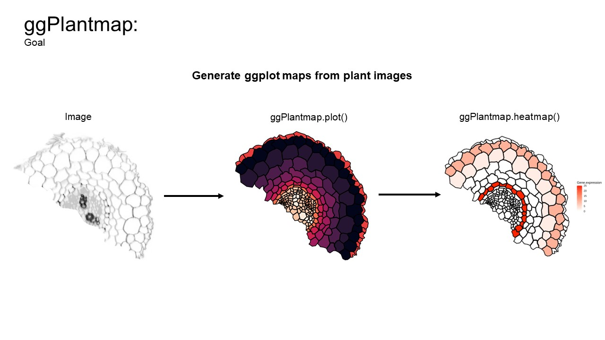
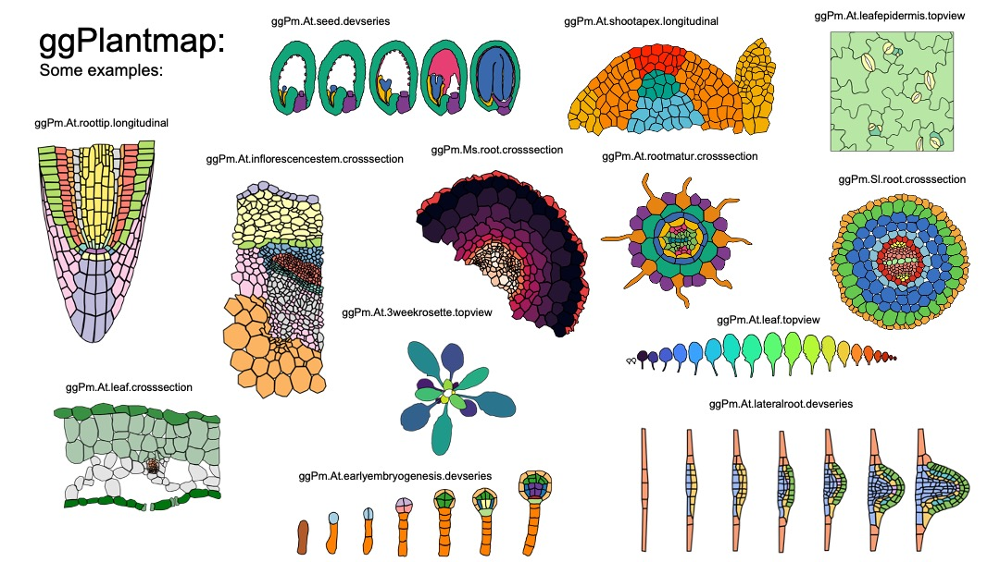
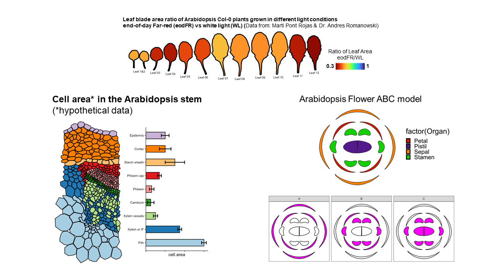
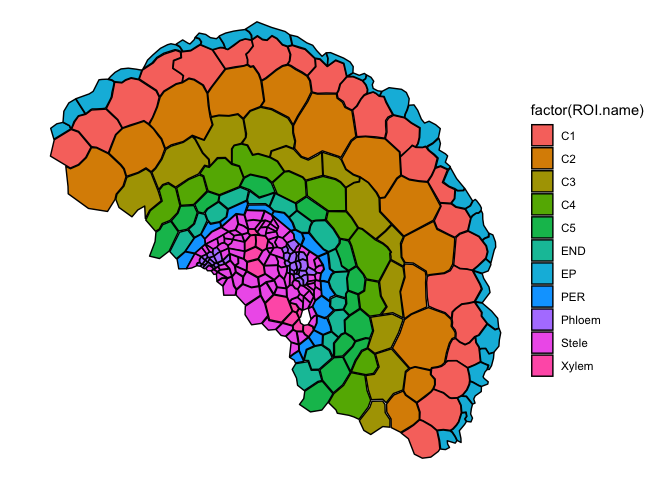

# ggPlantmap 

###### Version 1.0.0

###### Author: Leonardo Jo (<l.jo@uu.nl>)

<!-- badges: start -->

[](https://joss.theoj.org/papers/2642d62fd8fa1570556da2ba79923c9f)
<!-- badges: end -->

## Overview

ggPlantmap is an open-source R package with the goal of facilitating the
generation of informative ggplot maps from plant images to explore
quantitative cell-type specific data. When combined with external
quantitative data, ggPlantmap can be used for the visualization and
displaying of spatial profiles in distinct parts/cells of the plant.

Included in the package there is a set of pre-loaded maps created from
previously published plant images that can be directly inserted into a
ggplot coding workflow. ggPlantmap enables users to plot heatmap
signatures of gene expression or any spatial quantitative data onto
plant images providing a customizable and extensible platform for
visualizing, and analyzing spatial quantitative patterns within specific
plant regions This package uses the flexibility of the well-known
ggplot2 R package to allow users to tailor maps to their specific
research questions.


## Installation

``` r
##install devtools (if you haven't already)
install.packages("devtools")
library(devtools)

## Installing from a github respository
install_github("leonardojo/ggPlantmap")
```

## ggPlantmap useful guides (HIGHLY RECOMMENDED!)

I created a step-by-step [user
guide](https://github.com/leonardojo/ggPlantmap/blob/main/ggPlantmap.userguide.md)
to help users navigate through the package.

I also created a [step-by-step guide with
tips](https://github.com/leonardojo/ggPlantmap/blob/main/TutorialforXMLfile.pdf)
on how to create your own ggPlantmap.

Finally, here are some
[instructions](https://github.com/leonardojo/ggPlantmap/blob/main/contributetoggPlantmap.md)
on how your newly created ggPlantmap can be included in the package.

## What is a ggPlantmap?

Each unique ggPlantmap is a table (tibble) object with points
coordinates (x,y) of specific points of polygons (ROIs) extracted from
plant images.

``` r
library(ggPlantmap)
head(ggPm.At.roottip.longitudinal)
#> # A tibble: 6 × 7
#>   ROI.name    Level1   Level2 ROI.id point     x     y
#>   <chr>       <chr>    <chr>   <int> <int> <dbl> <dbl>
#> 1 Meristem.QC Meristem QC          1     1  121. -323.
#> 2 Meristem.QC Meristem QC          1     2  127. -315.
#> 3 Meristem.QC Meristem QC          1     3  134. -315.
#> 4 Meristem.QC Meristem QC          1     4  149. -318.
#> 5 Meristem.QC Meristem QC          1     5  149. -329.
#> 6 Meristem.QC Meristem QC          1     6  134. -327.
```


## Plotting a ggPlantmap

ggPlantmaps can be easily plotted using the ggPlantmap.plot() function.

``` r
library(ggPlantmap)
ggPlantmap.plot(ggPm.At.earlyembryogenesis.devseries,Cell)
```


``` r
ggPlantmap.plot(ggPm.At.roottip.longitudinal,Level1)
```


## Pre-loaded ggPlantmaps

The package contain a series of pre-loaded ggPlantmaps created from
previously published plant images. I hope to update the package with the
contribution of the plant research community.

``` r
library(ggPlantmap)
ggPm.summary
#> # A tibble: 16 × 9
#>    ggPlantmap.name   Species Tissue Type  Descr…¹ Layers Image…² Made.by Conta…³
#>    <chr>             <chr>   <chr>  <chr> <chr>   <chr>  <chr>   <chr>   <chr>  
#>  1 ggPm.At.roottip.… Arabid… root   cros… Cross-… Cells  https:… Leonar… jo.leo…
#>  2 ggPm.At.roottip.… Arabid… root   long… Longit… Cells  https:… Leonar… jo.leo…
#>  3 ggPm.At.3weekros… Arabid… roset… top … Top vi… Leaves https:… Leonar… jo.leo…
#>  4 ggPm.At.leafepid… Arabid… leaf … top … Top vi… Cells  https:… Leonar… jo.leo…
#>  5 ggPm.At.leaf.cro… Arabid… leaves cros… Cross-… Cells  https:… Leonar… jo.leo…
#>  6 ggPm.At.seed.dev… Arabid… seed   deve… Diagra… Cells… https:… Leonar… jo.leo…
#>  7 ggPm.At.earlyemb… Arabid… embryo deve… Diagra… Cells… https:… Leonar… jo.leo…
#>  8 ggPm.At.shootape… Arabid… shoot… long… Diagra… Layer… https:… Leonar… jo.leo…
#>  9 ggPm.At.inflores… Arabid… inflo… cros… Cross-… Cells  https:… Leonar… jo.leo…
#> 10 ggPm.Sl.root.cro… Solanu… root   cros… Cross-… Cells  https:… Leonar… jo.leo…
#> 11 ggPm.At.leaf.top… Arabid… leaf   top … Top vi… Leaves http:/… Leonar… jo.leo…
#> 12 ggPm.At.rootelon… Arabid… root … long… Longit… Cells  https:… Leonar… jo.leo…
#> 13 ggPm.At.rootmatu… Arabid… root … cros… Cross-… Cells  https:… Leonar… jo.leo…
#> 14 ggPm.At.flower.d… Arabid… flower diag… Diagra… Tissu… Taiz, … Leonar… jo.leo…
#> 15 ggPm.At.lateralr… Arabid… later… deve… Diagra… Cells… https:… Leonar… jo.leo…
#> 16 ggPm.Ms.root.cro… Medica… root   cros… Cross-… Cells  Unpubl… Leonar… jo.leo…
#> # … with abbreviated variable names ¹​Description, ²​Image.Reference,
#> #   ³​Contact.Info
```



## Color mapping

These maps can be easily loaded into a ggplot coding environment and
their color mapping changed based on the distinct layer classification
of each ggPlantmap.


## Overlaying external quantitative data into a ggPlantmap

With ggPlantmap you can overlay quantitative data into your ggPlantmap
to visualize it as sort of a heatmap. To do so, you will need another
table that contains quantitative data attributed to your ROIs.
<br />

This approach can be very helpful for R Shiny app developers to create
web interactive tools to visualize quantitative data in plant cell or
structures.

Some examples of heatmaps generated from available published data:
<br />
<br />

## Is ggPlantmap only usefull for molecular expression data?

Not at all. ggPlantmap can also be used to produce many other type of
plots. Essentially anything that you can trace, you can create! Be
creative! I hope to build a community where people explore the usage of
ggPlantmap for the communication of Plant science.

<br />

## How can I create my own ggPlantmap?

The principle of creating a ggPlantmap is fairly simple. We generate a
list of ROIs (region of interests) in the Icy open-source software
(<https://icy.bioimageanalysis.org/>) from any plant image. These ROIs
are saved as XML files and later be converted into ggPlantmaps with the
XML.to.ggPlantmap() function. [We created step-by-step guide with
tips](https://github.com/leonardojo/ggPlantmap/blob/main/TutorialforXMLfile.pdf)
on how to generate xml images from plant images.


``` r
new.ggPlantmap <- XML.to.ggPlantmap("data/ggPm.sample.xml")
ggPlantmap.plot(new.ggPlantmap,ROI.name)
```



## Can my ggPlantmap be included in the package?

YES!!! Any Plant map can be included in the package. Here are some
[instructions](https://github.com/leonardojo/ggPlantmap/blob/main/contributetoggPlantmap.md)
on how your newly created ggPlantmap can be included in the package.

If you create one, please email me (<l.jo@uu.nl>) your ggPlantmap as
tab-delimited table and I’ll make sure to include in the package. You
will be credited and your information will be displayed in the summary
file. I really hope this becomes an organic package with the
contribution of the plant research community.

## Acknowledgements

I would like to acknowledge Kaisa Kajala, Lisa Oskam, Monica Garcia
Gomez, Pierre Gautrat and Kyra van der Velde for testing ggPlantmap. I
also would like to acknowledge Andres Romanowski for providing some data
for the initial tests of ggPlantmap.

## How to cite

### Pre-print

Leonardo Jo, Kaisa Kajala. ggPlantmap: an R package for the graphic
mapping of plant images. Authorea. September 21, 2023. DOI:
10.22541/au.169531385.58441696/v1
