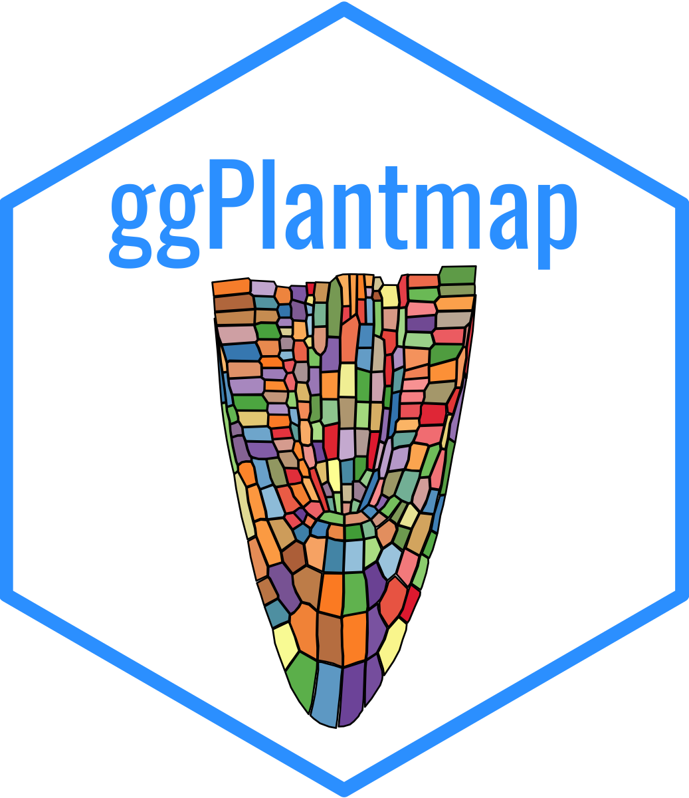
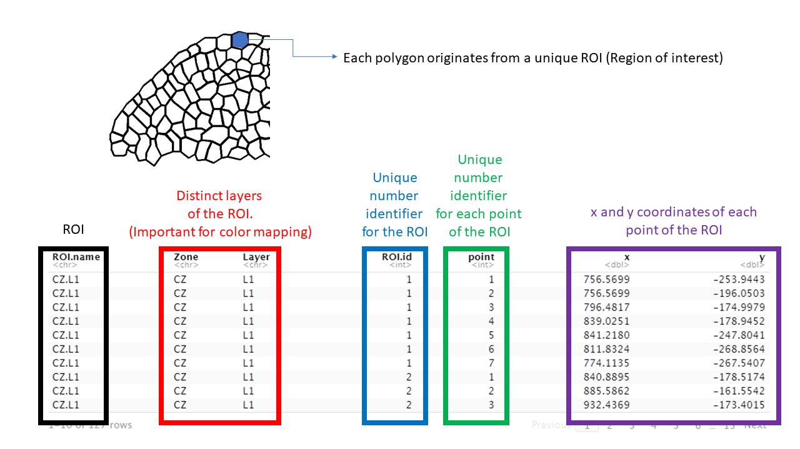
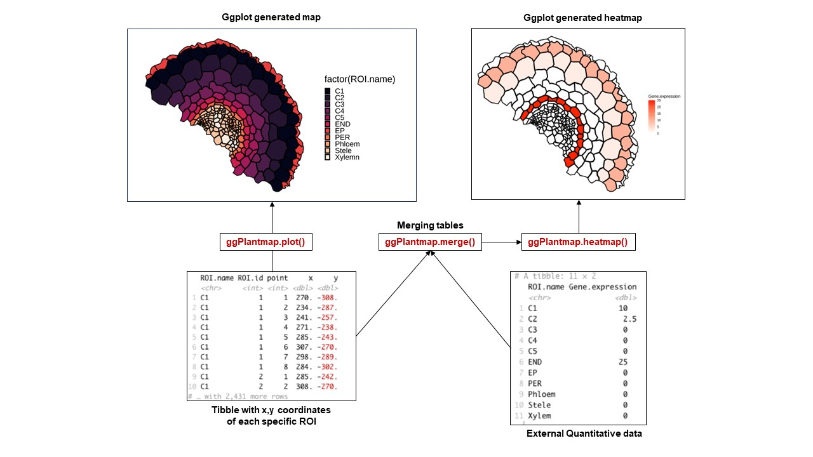
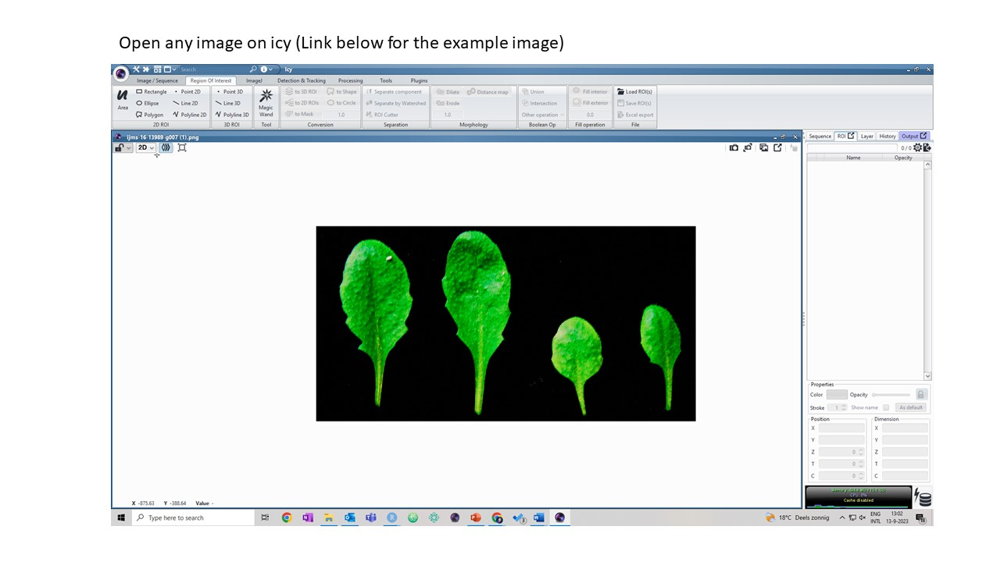
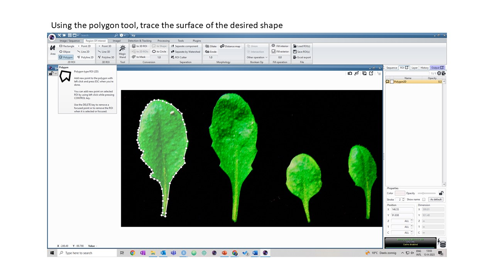
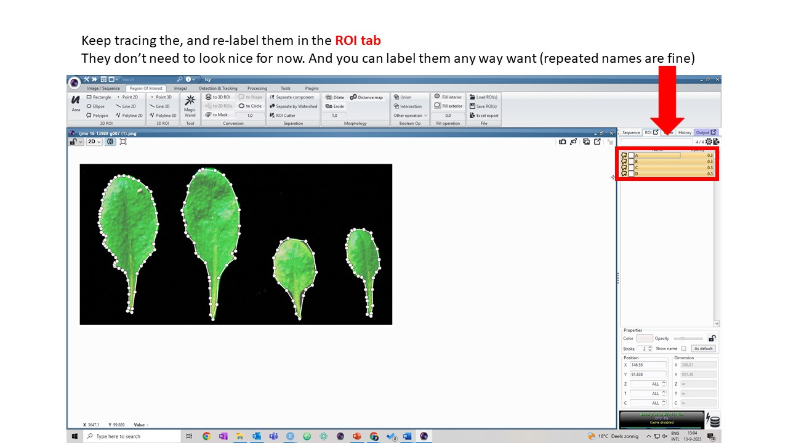
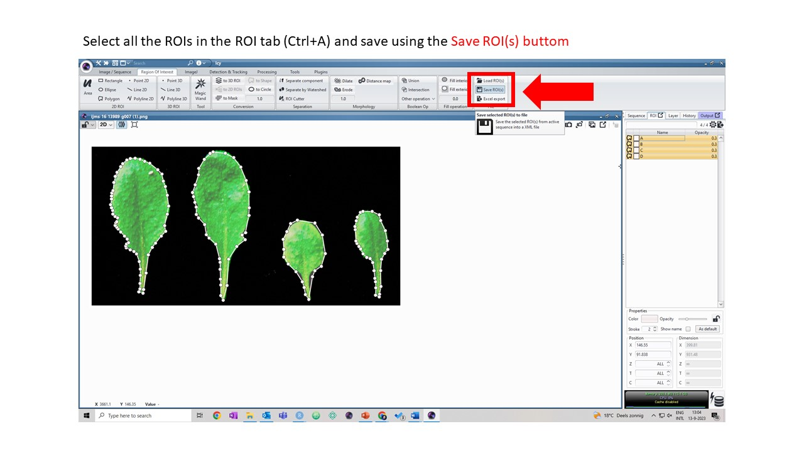
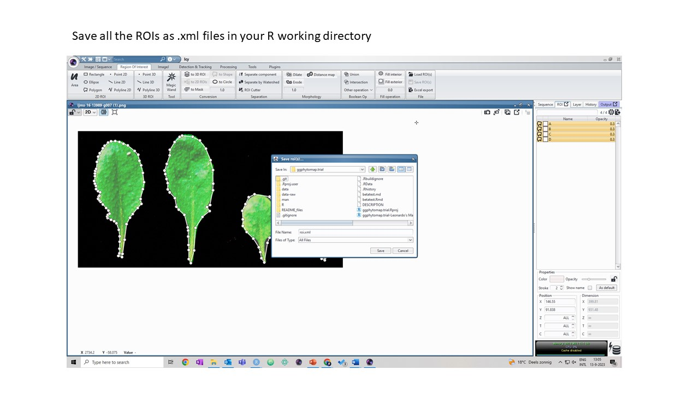

```{r, echo = FALSE}
knitr::opts_chunk$set(
  collapse = TRUE,
  comment = "#>",
  fig.path = "man/figures/userguide-"
)
```

# ggPlantmap User Guide 

## Introduction

ggPlantmap is an open-source R package with the goal of facilitating the generation of informative ggplot maps from plant images to explore quantitative cell-type specific data. When combined with external quantitative data, ggPlantmap can be used for the visualization and displaying of spatial profiles in distinct parts/cells of the plant. 

Included in the package there is a set of pre-loaded maps created from previously published plant images that can be directly inserted into a ggplot coding workflow. ggPlantmap enables users to plot heatmap signatures of gene expression or any spatial quantitative data onto plant images providing a customizable and extensible platform for visualizing, and analyzing spatial quantitative patterns within specific plant regions This package uses the flexibility of the well-known ggplot2 R package to allow users to tailor maps to their specific research questions.


## 1. Installing ggPlant map

```{r, eval = FALSE}
## ggPlantmap installation requires devtools.
library(devtools)
## If an error message appear, you might need to install it
install.packages("devtools")
library(devtools)

## Now you can try to install ggPlantmap
install_github("leonardojo/ggPlantmap")
```

ggPlantmap requires the following packages:
ggplot2, dplyr, XML
the package will try to install them with the most updated version from CRAN, you can ignore them if you want.
A warning message can appear, but you can still try to run it.


## 2. Navigating through ggPlantmap
### 2.1 Loading ggPlantmap

```{r}
library(ggPlantmap)
```

### 2.2 Exploring ggPm.summary
The list of preloaded objects can be found in the ggPm.summary file
```{r}
head(ggPm.summary)
```
In this summary you can find the name of the ggPlantmap objects loaded in the package as well as other information about the map, such as species, tissue, description and the reference paper where the map was based on. In addition, information about the author of the map can also be found.

These are the pre-loaded ggPlantmap objects:
```{r}
ggPm.summary$ggPlantmap.name
```

### 2.3 Opening some of the pre-loaded objects
To load a pre-loaded ggPlantmap, just write their name on your console.
These objects can be assigned as objects and they can be considered as regular tibbles.
```{r,warning=F}
ggPm.At.lateralroot.devseries
p <- ggPm.At.shootapex.longitudinal
p
```

### Overview of a ggPlantmap
<br />


### 2.4 Documentation of functions and objects in ggPlantmap
For more information, please open the R documentation file for each specific object or function
```{r,eval=F}
?ggPm.At.lateralroot.devseries
?ggPm.At.seed.devseries
?ggPm.Ms.root.crosssection

## Same for all the functions
?XML.to.ggPlantmap()
?ggPlantmap.heatmap()
?ggPlantmap.plot()
?ggPlantmap.merge()
```

### 2.5 Producing a ggPlantmap plot
Run the ggPlantmap.plot() function to create a plot:
```{r}
ggPlantmap.plot(data=ggPm.At.lateralroot.devseries) ## or ggPlantmap.plot(ggPm.At.lateralroot.devseries)
```

### Note that the same plot can be obtained using geom_polygon() on ggplot2
```{r}
library(ggplot2)
ggplot(ggPm.At.lateralroot.devseries,aes(x,y)) +
  geom_polygon(aes(group=ROI.id,fill=ROI.name),colour="black") +
  coord_fixed()
```

### 2.6 Changing the color map, legends and aesthetics
You can change the color mapping based on different layers of each ROI of the ggPlantmap
Each ggPlantmap is separated by specific layers, you can access them by checking the column name.
For example, the shoot apex ggPlantmap is divided into Zone and Layers
```{r}
head(ggPm.At.shootapex.longitudinal)
```

To decide which layer should be used to colormap, add the name of the column in the layer parameter of the function.
```{r}
ggPlantmap.plot(ggPm.At.shootapex.longitudinal,layer=Zone)
ggPlantmap.plot(ggPm.At.shootapex.longitudinal,layer=Layer)
ggPlantmap.plot(ggPm.At.shootapex.longitudinal,layer=ROI.id,show.legend = FALSE)
## Note that in the last example I included show.legend=FALSE, that's because if you map based on individual ROIs,
## there will be too many of them, so you can exclude the legend in the plot by adding the option
```


## Different maps will have different layers

Because each polygon on ggPlantmap is characterized by specific levels (examples: Region,Stage,Part), you can color map them individually. Using ggPlantmap, you can color map based on unique layers of the ggPlantmap.
Each map will have their own classification. If you would like to adjust or create your own classification, you can save the ggPlantmap as a table and modify it on to mach the degree of separation you want to show.
```{r,warning=F}
library(ggplot2)
library(cowplot)

head(ggPm.At.seed.devseries)

## Stage: Seed development stage
## Part: Distinct parts of a seed (Seed coat, Endosperm and Embryo)
## Region: Specific regions of each part of the Arabidopsis seed
## Reference: Belmonte, Mark F., et al. "Comprehensive developmental profiles of gene activity in regions and subregions of the Arabidopsis seed." Proceedings of the National Academy of Sciences 110.5 (2013): E435-E444.

a <- ggPlantmap.plot(ggPm.At.seed.devseries,Region,linewidth = 0.5) +
  scale_fill_brewer(palette="Set3") +
  ggtitle("Regions of Arabidopsis seed development") +
   theme(legend.key.height= unit(0.25, 'cm'),
        legend.key.width= unit(0.25, 'cm'))
b <- ggPlantmap.plot(ggPm.At.seed.devseries,Stage,linewidth = 0.5) +
  scale_fill_brewer(palette="Set1") +
  ggtitle("Stages of Arabidopsis seed development") +
   theme(legend.key.height= unit(0.25, 'cm'),
        legend.key.width= unit(0.25, 'cm'))
c <- ggPlantmap.plot(ggPm.At.seed.devseries,Part,linewidth = 0.5) +
  scale_fill_brewer(palette="Set1") +
  ggtitle("Parts of Arabidopsis seed development") +
   theme(legend.key.height= unit(0.25, 'cm'),
        legend.key.width= unit(0.25, 'cm'))
plot_grid(a,b,c,ncol=1,labels=c("a","b","c"),align = "v")
```

You can also change the width of the tracing line
```{r}
ggPlantmap.plot(ggPm.At.shootapex.longitudinal,layer=Zone,linewidth = 1)
ggPlantmap.plot(ggPm.At.shootapex.longitudinal,layer=Zone,linewidth = 5)
```


### 2.7 Working in ggPlantmap through ggplot command lines.
ggPlantmap is a ggplot based package, so you can change the aesthetics using ggplot coding logic.
```{r}
library(ggplot2)
library(viridis)
## Changing the colors
ggPlantmap.plot(ggPm.At.inflorescencestem.crosssection) +
  scale_fill_brewer(palette="Paired")

ggPlantmap.plot(ggPm.At.leaf.topview,show.legend = F) +
  scale_fill_viridis(option="H",discrete=T) +
  theme_bw()

```

## 3. Overlay quantitative data

With ggPlantmap you can overlay quantitative data into your ggPlantmap to visualize it as sort of a heatmap.
To do so, you will need another table with contains quantitative data attributed to your ROIs.
<br />
<b>IMPORTANT!!!!

Note that the name of the ROI levels on your map should exactly match the ones on your quantitative data!!!</b>

### 3.1 Merging quantitative data to your ggPlantmap
Included in the package is a sample quantitative data:
The expression of LEC1 during the development of Arabidopsis seed.
```{r}
ggPm.At.seed.expression.sample

```
Let's combine this dataset with the ggPlantmap for Arabidopsis seeds
```{r}
ggPm.At.seed.devseries
```
To do so, let's use the ggPlantmap.merge() function
You need to specify as a character the name of the column in which the common names between tables are found
In this example: ROI.name
```{r}
##ggPlantmap comes first, expression data comes second.
ggPlantmap.merge(ggPm.At.seed.devseries,ggPm.At.seed.expression.sample,"ROI.name")
quant.data <- ggPlantmap.merge(ggPm.At.seed.devseries,ggPm.At.seed.expression.sample,"ROI.name")
```
What if the column names for my ROI levels are not the same between the data?
In this case, you can specify which column is to used to merge the two tables.
```{r}
ggPlantmap.merge(ggPm.Sl.root.crosssection,ggPm.tomatoatlas.expression.sample,"ROI.name","Cell.layer")
```

### 3.2 Producing a heatmap
You can now produce a heatmap from your ggPlantmap by running the function ggPlantmap.heatmap()
In addition to the merged object, you also need to include the column where the quant values are found.
In this example: AT5G47670.expression
```{r}
ggPlantmap.heatmap(quant.data,AT5G47670.expression)

## you can change the gradient
ggPlantmap.heatmap(quant.data,AT5G47670.expression) +
  scale_fill_gradient(low="white",high="darkred")
```

### 4 Create your own ggPlantmap
Hopefully by now you should be a little familiar with the package.
But we encourage you to create your own ggPlantmap.
To do so, we will require a specific open-source imaging software called Icy (https://icy.bioimageanalysis.org/).
Source image: https://www.mdpi.com/ijms/ijms-16-13989/article_deploy/html/images/ijms-16-13989-g007.png

<br />
<br />
<br />
<br />
<br />
Now that you have your .xml file, let's run the function XML.to.ggPlantmap() function to create your map
```{r}
## Just make sure that the xml file is in your path
new.ggPlantmap <- XML.to.ggPlantmap("data-raw/roi.xml")
ggPlantmap.plot(new.ggPlantmap,ROI.name)
```

A more detailed tutorial can be found 
[here](https://github.com/leonardojo/ggPlantmap/blob/main/Tutorial%20for%20XML%20file.pdf) on how to generate xml images from plant images.

### 5 That's it!
Hopefully everything ran smoothly. Thank you very much for your interest in ggPlantmap!
If you want your map to be included in the package. Please send me an email with a tab delimited table version of your ggPlantmap with specific description. I will make sure to include it in future versions.
Looking forward to hear from you any suggestions on how to improve ggPlantmap!
