# ggPlantmap User Guide 

## Introduction

ggPlantmap is an open-source R package with the goal of facilitating the
generation of informative ggplot maps from plant images to explore
quantitative cell-type specific data. When combined with external
quantitative data, ggPlantmap can be used for the visualization and
displaying of spatial profiles in distinct parts/cells of the plant.

Included in the package there is a set of pre-loaded maps created from
previously published plant images that can be directly inserted into a
ggplot coding workflow. ggPlantmap enables users to plot heatmap
signatures of gene expression or any spatial quantitative data onto
plant images providing a customizable and extensible platform for
visualizing, and analyzing spatial quantitative patterns within specific
plant regions This package uses the flexibility of the well-known
ggplot2 R package to allow users to tailor maps to their specific
research questions.

## 1. Installing ggPlantmap

``` r
## ggPlantmap installation requires devtools.
library(devtools)
## If an error message appear, you might need to install it
install.packages("devtools")
library(devtools)

## Now you can try to install ggPlantmap
install_github("leonardojo/ggPlantmap")
```

ggPlantmap requires the following packages: ggplot2, dplyr, XML the
package will try to install them with the most updated version from
CRAN, you can ignore them if you want. A warning message can appear, but
you can still try to run it.

## 2. Navigating through ggPlantmap

### 2.1 Loading ggPlantmap

``` r
library(ggPlantmap)
```

### 2.2 Exploring ggPm.summary

The list of preloaded objects can be found in the ggPm.summary file

``` r
head(ggPm.summary)
#> # A tibble: 6 × 9
#>   ggPlantmap.name        Species Tissue Type  Description Layers Image.Reference
#>   <chr>                  <chr>   <chr>  <chr> <chr>       <chr>  <chr>          
#> 1 ggPm.At.roottip.cross… Arabid… root   cros… Cross-sect… Cells  https://www.fu…
#> 2 ggPm.At.roottip.longi… Arabid… root   long… Longitudin… Cells  https://doi.or…
#> 3 ggPm.At.3weekrosette.… Arabid… roset… top … Top view o… Leaves https://doi.or…
#> 4 ggPm.At.leafepidermis… Arabid… leaf … top … Top view o… Cells  https://www.na…
#> 5 ggPm.At.leaf.crosssec… Arabid… leaves cros… Cross-sect… Cells  https://doi.or…
#> 6 ggPm.At.seed.devseries Arabid… seed   deve… Diagram of… Cells… https://doi.or…
#> # ℹ 2 more variables: Made.by <chr>, Contact.Info <chr>
```

In this summary you can find the name of the ggPlantmap objects loaded
in the package as well as other information about the map, such as
species, tissue, description and the reference paper where the map was
based on. In addition, information about the author of the map can also
be found.

These are the pre-loaded ggPlantmap objects:

``` r
ggPm.summary$ggPlantmap.name
#>  [1] "ggPm.At.roottip.crosssection"          
#>  [2] "ggPm.At.roottip.longitudinal"          
#>  [3] "ggPm.At.3weekrosette.topview"          
#>  [4] "ggPm.At.leafepidermis.topview"         
#>  [5] "ggPm.At.leaf.crosssection"             
#>  [6] "ggPm.At.seed.devseries"                
#>  [7] "ggPm.At.earlyembryogenesis.devseries"  
#>  [8] "ggPm.At.shootapex.longitudinal"        
#>  [9] "ggPm.At.inflorescencestem.crosssection"
#> [10] "ggPm.Sl.root.crosssection"             
#> [11] "ggPm.At.leaf.topview"                  
#> [12] "ggPm.At.rootelong.longitudinal"        
#> [13] "ggPm.At.rootmatur.crosssection"        
#> [14] "ggPm.At.flower.diagram"                
#> [15] "ggPm.At.lateralroot.devseries"         
#> [16] "ggPm.Ms.root.crosssection"
```

### 2.3 Opening some of the pre-loaded objects

To load a pre-loaded ggPlantmap, just write their name on your console.
These objects can be assigned as objects and they can be considered as
regular tibbles.

``` r
ggPm.At.lateralroot.devseries
#> # A tibble: 3,415 × 7
#>    ROI.name         Stage  Cell      ROI.id point     x     y
#>    <chr>            <chr>  <chr>      <int> <int> <dbl> <dbl>
#>  1 Stage1.Pericycle Stage1 Pericycle      1     1  109. -407.
#>  2 Stage1.Pericycle Stage1 Pericycle      1     2  108. -191.
#>  3 Stage1.Pericycle Stage1 Pericycle      1     3  126. -194.
#>  4 Stage1.Pericycle Stage1 Pericycle      1     4  136. -407.
#>  5 Stage1.Pericycle Stage1 Pericycle      2     1  108. -478.
#>  6 Stage1.Pericycle Stage1 Pericycle      2     2  109. -407.
#>  7 Stage1.Pericycle Stage1 Pericycle      2     3  136. -408.
#>  8 Stage1.Pericycle Stage1 Pericycle      2     4  141. -479.
#>  9 Stage1.Pericycle Stage1 Pericycle      3     1  108. -479.
#> 10 Stage1.Pericycle Stage1 Pericycle      3     2  141. -479.
#> # ℹ 3,405 more rows
p <- ggPm.At.shootapex.longitudinal
p
#> # A tibble: 1,218 × 7
#>    ROI.name Zone  Layer ROI.id point     x     y
#>    <chr>    <chr> <chr>  <int> <int> <dbl> <dbl>
#>  1 CZ.L1    CZ    L1         1     1  757. -254.
#>  2 CZ.L1    CZ    L1         1     2  757. -196.
#>  3 CZ.L1    CZ    L1         1     3  796. -175.
#>  4 CZ.L1    CZ    L1         1     4  839. -179.
#>  5 CZ.L1    CZ    L1         1     5  841. -248.
#>  6 CZ.L1    CZ    L1         1     6  812. -269.
#>  7 CZ.L1    CZ    L1         1     7  774. -268.
#>  8 CZ.L1    CZ    L1         2     1  841. -179.
#>  9 CZ.L1    CZ    L1         2     2  886. -162.
#> 10 CZ.L1    CZ    L1         2     3  932. -173.
#> # ℹ 1,208 more rows
```

### Overview of a ggPlantmap

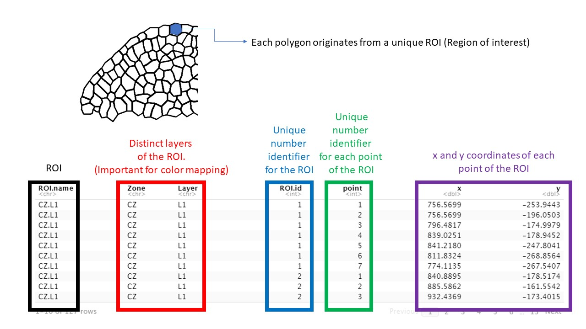<br />

### 2.4 Documentation of functions and objects in ggPlantmap

For more information, please open the R documentation file for each
specific object or function

``` r
?ggPm.At.lateralroot.devseries
?ggPm.At.seed.devseries
?ggPm.Ms.root.crosssection

## Same for all the functions
?XML.to.ggPlantmap()
?ggPlantmap.heatmap()
?ggPlantmap.plot()
?ggPlantmap.merge()
```

### 2.5 Producing a ggPlantmap plot

Run the ggPlantmap.plot() function to create a plot:

``` r
ggPlantmap.plot(data=ggPm.At.lateralroot.devseries) ## or ggPlantmap.plot(ggPm.At.lateralroot.devseries)
```

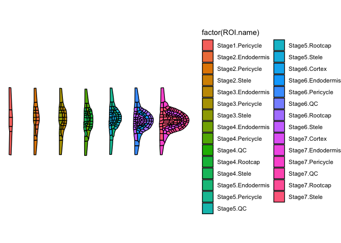<!-- -->

### Note that the same plot can be obtained using geom_polygon() on ggplot2

``` r
library(ggplot2)
ggplot(ggPm.At.lateralroot.devseries,aes(x,y)) +
  geom_polygon(aes(group=ROI.id,fill=ROI.name),colour="black") +
  coord_fixed()
```

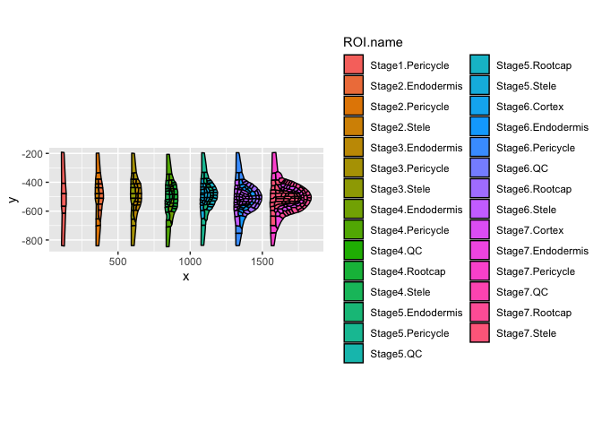<!-- -->

### 2.6 Changing the color map, legends and aesthetics

You can change the color mapping based on different layers of each ROI
of the ggPlantmap Each ggPlantmap is separated by specific layers, you
can access them by checking the column name. For example, the shoot apex
ggPlantmap is divided into Zone and Layers

``` r
head(ggPm.At.shootapex.longitudinal)
#> # A tibble: 6 × 7
#>   ROI.name Zone  Layer ROI.id point     x     y
#>   <chr>    <chr> <chr>  <int> <int> <dbl> <dbl>
#> 1 CZ.L1    CZ    L1         1     1  757. -254.
#> 2 CZ.L1    CZ    L1         1     2  757. -196.
#> 3 CZ.L1    CZ    L1         1     3  796. -175.
#> 4 CZ.L1    CZ    L1         1     4  839. -179.
#> 5 CZ.L1    CZ    L1         1     5  841. -248.
#> 6 CZ.L1    CZ    L1         1     6  812. -269.
```

To decide which layer should be used to colormap, add the name of the
column in the layer parameter of the function.

``` r
ggPlantmap.plot(ggPm.At.shootapex.longitudinal,layer=Zone)
```

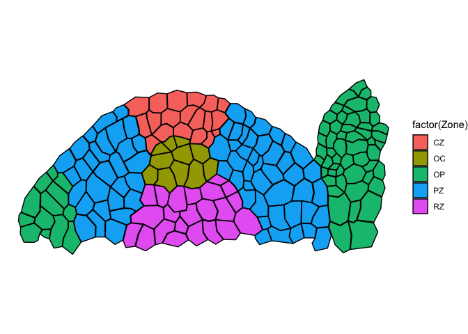<!-- -->

``` r
ggPlantmap.plot(ggPm.At.shootapex.longitudinal,layer=Layer)
```

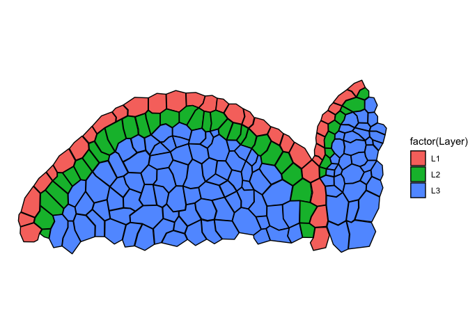<!-- -->

``` r
ggPlantmap.plot(ggPm.At.shootapex.longitudinal,layer=ROI.id,show.legend = FALSE)
```

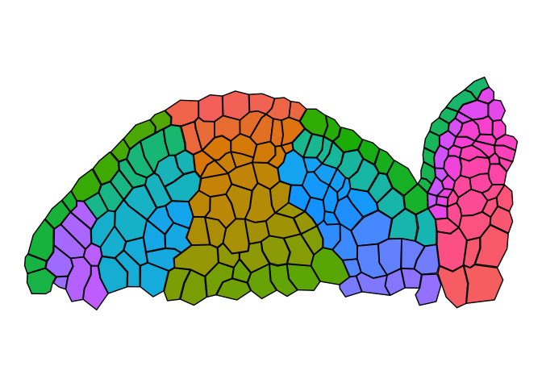<!-- -->

``` r
## Note that in the last example I included show.legend=FALSE, that's because if you map based on individual ROIs,
## there will be too many of them, so you can exclude the legend in the plot by adding the option
```

## Different maps will have different layers

Because each polygon on ggPlantmap is characterized by specific levels
(examples: Region,Stage,Part), you can color map them individually.
Using ggPlantmap, you can color map based on unique layers of the
ggPlantmap. Each map will have their own classification. If you would
like to adjust or create your own classification, you can save the
ggPlantmap as a table and modify it on to mach the degree of separation
you want to show.

``` r
library(ggplot2)
library(cowplot)

head(ggPm.At.seed.devseries)
#> # A tibble: 6 × 8
#>   ROI.name                           Stage Part  Region ROI.id point     x     y
#>   <chr>                              <chr> <chr> <chr>   <int> <int> <dbl> <dbl>
#> 1 Preglobular.seedcoat.Distal Seed … Preg… seed… Dista…      1     1  277. -693.
#> 2 Preglobular.seedcoat.Distal Seed … Preg… seed… Dista…      1     2  280. -689.
#> 3 Preglobular.seedcoat.Distal Seed … Preg… seed… Dista…      1     3  280. -685.
#> 4 Preglobular.seedcoat.Distal Seed … Preg… seed… Dista…      1     4  285. -681.
#> 5 Preglobular.seedcoat.Distal Seed … Preg… seed… Dista…      1     5  286. -675.
#> 6 Preglobular.seedcoat.Distal Seed … Preg… seed… Dista…      1     6  286. -669.

## Stage: Seed development stage
## Part: Distinct parts of a seed (Seed coat, Endosperm and Embryo)
## Region: Specific regions of each part of the Arabidopsis seed
## Reference: Belmonte, Mark F., et al. "Comprehensive developmental profiles of gene activity in regions and subregions of the Arabidopsis seed." Proceedings of the National Academy of Sciences 110.5 (2013): E435-E444.

a <- ggPlantmap.plot(ggPm.At.seed.devseries,Region,linewidth = 0.5) +
  scale_fill_brewer(palette="Set3") +
  ggtitle("Regions of Arabidopsis seed development") +
   theme(legend.key.height= unit(0.25, 'cm'),
        legend.key.width= unit(0.25, 'cm'))
b <- ggPlantmap.plot(ggPm.At.seed.devseries,Stage,linewidth = 0.5) +
  scale_fill_brewer(palette="Set1") +
  ggtitle("Stages of Arabidopsis seed development") +
   theme(legend.key.height= unit(0.25, 'cm'),
        legend.key.width= unit(0.25, 'cm'))
c <- ggPlantmap.plot(ggPm.At.seed.devseries,Part,linewidth = 0.5) +
  scale_fill_brewer(palette="Set1") +
  ggtitle("Parts of Arabidopsis seed development") +
   theme(legend.key.height= unit(0.25, 'cm'),
        legend.key.width= unit(0.25, 'cm'))
plot_grid(a,b,c,ncol=1,labels=c("a","b","c"),align = "v")
```

<!-- -->

You can also change the width of the tracing line

``` r
ggPlantmap.plot(ggPm.At.shootapex.longitudinal,layer=Zone,linewidth = 1)
```

<!-- -->

``` r
ggPlantmap.plot(ggPm.At.shootapex.longitudinal,layer=Zone,linewidth = 5)
```

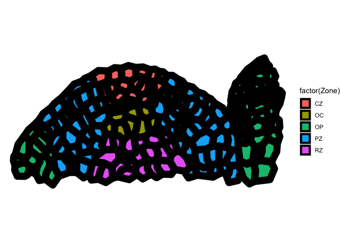<!-- -->

### 2.7 Working in ggPlantmap through ggplot command lines.

ggPlantmap is a ggplot based package, so you can change the aesthetics
using ggplot coding logic.

``` r
library(ggplot2)
library(viridis)
#> Loading required package: viridisLite
## Changing the colors
ggPlantmap.plot(ggPm.At.inflorescencestem.crosssection) +
  scale_fill_brewer(palette="Paired")
```

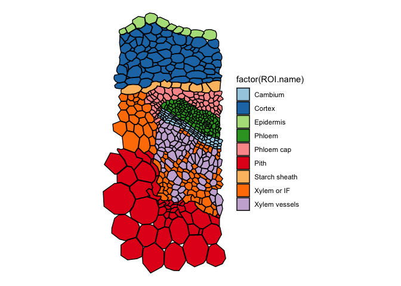<!-- -->

``` r

ggPlantmap.plot(ggPm.At.leaf.topview,show.legend = F) +
  scale_fill_viridis(option="H",discrete=T) +
  theme_bw()
```

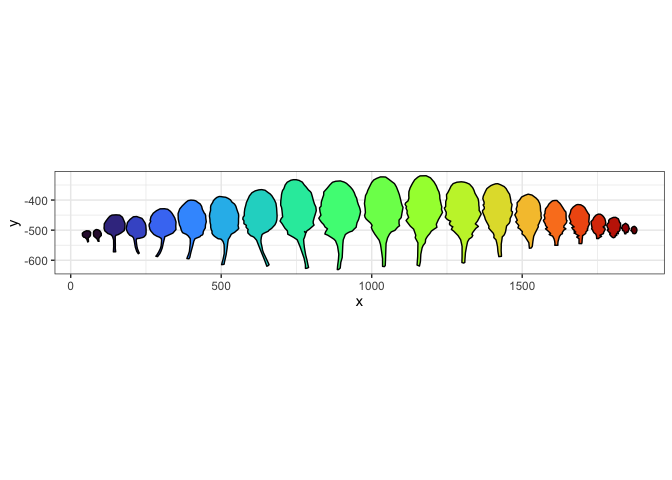<!-- -->

## 3. Overlay quantitative data

With ggPlantmap you can overlay quantitative data into your ggPlantmap
to visualize it as sort of a heatmap. To do so, you will need another
table with contains quantitative data attributed to your ROIs.
<br />

<b> \### IMPORTANT!!!!

Note that the name of the ROI levels on your map should exactly match
the ones on your quantitative data!!!</b>

### 3.1 Merging quantitative data to your ggPlantmap

Included in the package is a sample quantitative data: The expression of
LEC1 during the development of Arabidopsis seed.

``` r
ggPm.At.seed.expression.sample
#> # A tibble: 30 × 2
#>    ROI.name                                AT5G47670.expression
#>    <chr>                                                  <int>
#>  1 Globular.endosperm.Chalazal Endosperm                     16
#>  2 Globular.seedcoat.Chalazal Seed Coat                       8
#>  3 Globular.embryo.Embryo Proper                             10
#>  4 Globular.endosperm.Micropylar Endosperm                   48
#>  5 Globular.endosperm.Peripheral Endosperm                   10
#>  6 Globular.seedcoat.Distal Seed Coat                        10
#>  7 Heart.endosperm.Chalazal Endosperm                        16
#>  8 Heart.seedcoat.Chalazal Seed Coat                         11
#>  9 Heart.embryo.Embryo Proper                                23
#> 10 Heart.endosperm.Micropylar Endosperm                      39
#> # ℹ 20 more rows
```

Let’s combine this dataset with the ggPlantmap for Arabidopsis seeds

``` r
ggPm.At.seed.devseries
#> # A tibble: 5,369 × 8
#>    ROI.name                          Stage Part  Region ROI.id point     x     y
#>    <chr>                             <chr> <chr> <chr>   <int> <int> <dbl> <dbl>
#>  1 Preglobular.seedcoat.Distal Seed… Preg… seed… Dista…      1     1  277. -693.
#>  2 Preglobular.seedcoat.Distal Seed… Preg… seed… Dista…      1     2  280. -689.
#>  3 Preglobular.seedcoat.Distal Seed… Preg… seed… Dista…      1     3  280. -685.
#>  4 Preglobular.seedcoat.Distal Seed… Preg… seed… Dista…      1     4  285. -681.
#>  5 Preglobular.seedcoat.Distal Seed… Preg… seed… Dista…      1     5  286. -675.
#>  6 Preglobular.seedcoat.Distal Seed… Preg… seed… Dista…      1     6  286. -669.
#>  7 Preglobular.seedcoat.Distal Seed… Preg… seed… Dista…      1     7  285. -663.
#>  8 Preglobular.seedcoat.Distal Seed… Preg… seed… Dista…      1     8  284. -659.
#>  9 Preglobular.seedcoat.Distal Seed… Preg… seed… Dista…      1     9  284. -656.
#> 10 Preglobular.seedcoat.Distal Seed… Preg… seed… Dista…      1    10  286. -653.
#> # ℹ 5,359 more rows
```

To do so, let’s use the ggPlantmap.merge() function You need to specify
as a character the name of the column in which the common names between
tables are found In this example: ROI.name

``` r
##ggPlantmap comes first, expression data comes second.
ggPlantmap.merge(ggPm.At.seed.devseries,ggPm.At.seed.expression.sample,"ROI.name")
#> # A tibble: 5,369 × 9
#>    ROI.name     Stage Part  Region ROI.id point     x     y AT5G47670.expression
#>    <chr>        <chr> <chr> <chr>   <int> <int> <dbl> <dbl>                <int>
#>  1 Preglobular… Preg… seed… Dista…      1     1  277. -693.                    8
#>  2 Preglobular… Preg… seed… Dista…      1     2  280. -689.                    8
#>  3 Preglobular… Preg… seed… Dista…      1     3  280. -685.                    8
#>  4 Preglobular… Preg… seed… Dista…      1     4  285. -681.                    8
#>  5 Preglobular… Preg… seed… Dista…      1     5  286. -675.                    8
#>  6 Preglobular… Preg… seed… Dista…      1     6  286. -669.                    8
#>  7 Preglobular… Preg… seed… Dista…      1     7  285. -663.                    8
#>  8 Preglobular… Preg… seed… Dista…      1     8  284. -659.                    8
#>  9 Preglobular… Preg… seed… Dista…      1     9  284. -656.                    8
#> 10 Preglobular… Preg… seed… Dista…      1    10  286. -653.                    8
#> # ℹ 5,359 more rows
quant.data <- ggPlantmap.merge(ggPm.At.seed.devseries,ggPm.At.seed.expression.sample,"ROI.name")
```

What if the column names for my ROI levels are not the same between the
data? In this case, you can specify which column is to used to merge the
two tables.

``` r
ggPlantmap.merge(ggPm.Sl.root.crosssection,ggPm.tomatoatlas.expression.sample,"ROI.name","Cell.layer")
#> # A tibble: 4,314 × 6
#>    ROI.name  ROI.id point     x     y SCR.expression
#>    <chr>      <int> <int> <dbl> <dbl>          <dbl>
#>  1 Exodermis      1     1  615. -370.              0
#>  2 Exodermis      1     2  601. -349.              0
#>  3 Exodermis      1     3  598. -327.              0
#>  4 Exodermis      1     4  617. -312.              0
#>  5 Exodermis      1     5  636. -307.              0
#>  6 Exodermis      1     6  651. -310.              0
#>  7 Exodermis      1     7  671. -327.              0
#>  8 Exodermis      1     8  684. -343.              0
#>  9 Exodermis      1     9  676. -354.              0
#> 10 Exodermis      1    10  668. -365.              0
#> # ℹ 4,304 more rows
```

### 3.2 Producing a heatmap

You can now produce a heatmap from your ggPlantmap by running the
function ggPlantmap.heatmap() In addition to the merged object, you also
need to include the column where the quant values are found. In this
example: AT5G47670.expression

``` r
ggPlantmap.heatmap(quant.data,AT5G47670.expression)
```

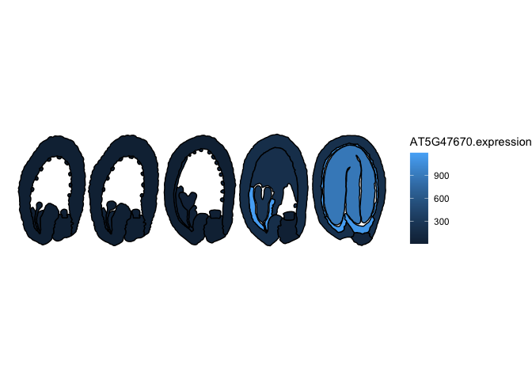<!-- -->

``` r

## you can change the gradient
ggPlantmap.heatmap(quant.data,AT5G47670.expression) +
  scale_fill_gradient(low="white",high="darkred")
```

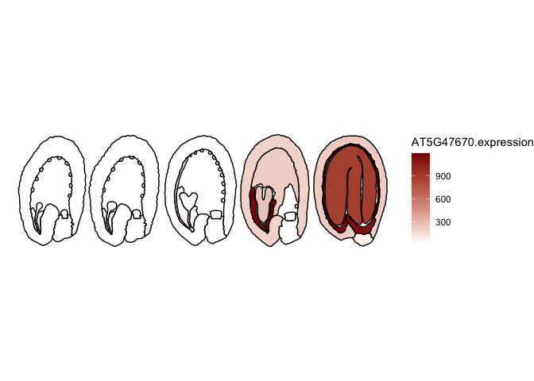<!-- -->

### 4 Create your own ggPlantmap

Hopefully by now you should be a little familiar with the package. But I
encourage you to create your own ggPlantmap. To do so, we will require a
specific open-source imaging software called Icy
(<https://icy.bioimageanalysis.org/>). Source image:
<https://www.mdpi.com/ijms/ijms-16-13989/article_deploy/html/images/ijms-16-13989-g007.png>

<br />
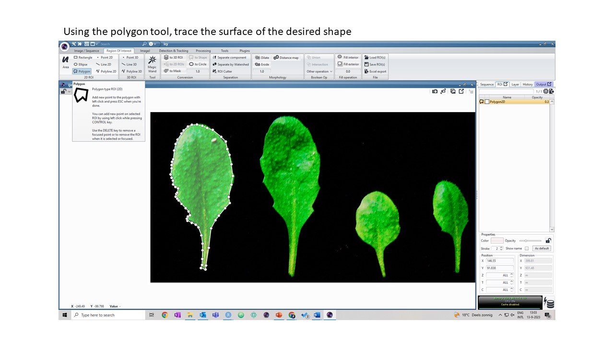<br />
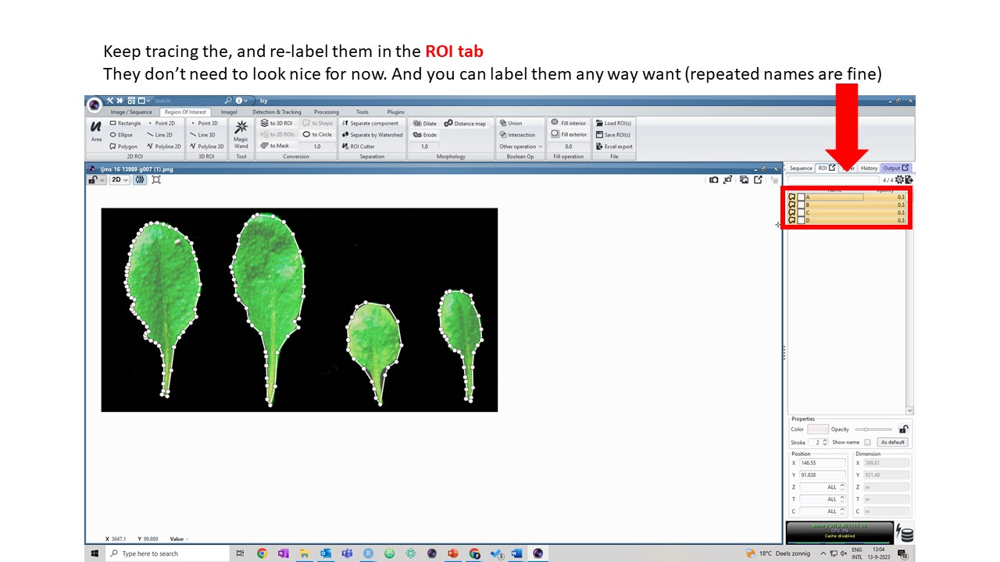<br />
<br />
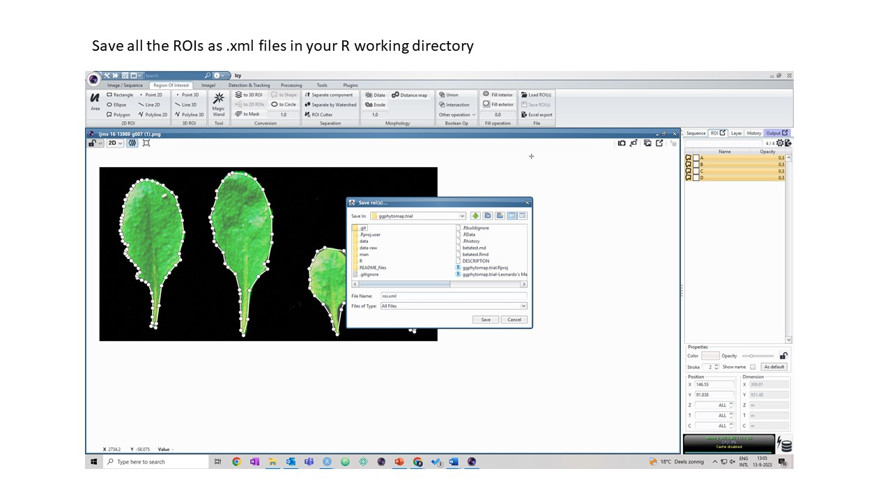<br />
Now that you have your .xml file, let’s run the function
XML.to.ggPlantmap() function to create your map

``` r
new.ggPlantmap <- XML.to.ggPlantmap("data/roi.xml")
ggPlantmap.plot(new.ggPlantmap,ROI.name)
```

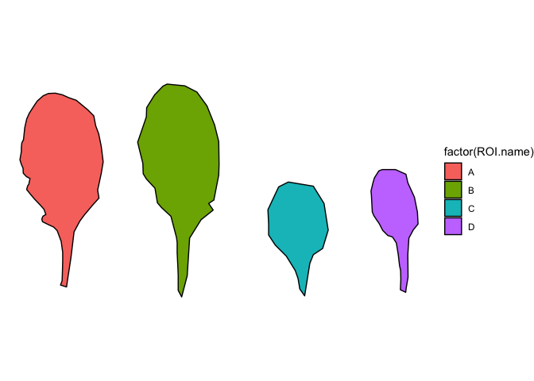<!-- -->

A more detailed tutorial can be found
[here](https://github.com/leonardojo/ggPlantmap/blob/main/TutorialforXMLfile.pdf)
on how to generate xml images from plant images.

### 5 Creating an SVG file

You can convert your ggPlantmap table into an SVG file that can be used
to create a ePlant EFP Browser or to be opened as a interactive object
in a graphic software. For example: Illustrator or Powerpoint

``` r
ggPlantmap.to.SVG(ggPm.At.3weekrosette.topview,
                  group.name = "ROI.name",
                  author = "ggPlantmap",
                  svg.name="ggPlantmap.svg")
## This will create an image file (.svg) that can be opened in an graphic software (Illustrator, Power-Point)
```

Note that the polygons will be grouped based on a column that you input
in the group.name argument. The default is “ROI.name”

### 6 That’s it!

Hopefully everything ran smoothly. Thank you very much for your interest
in ggPlantmap! If you want your map to be included in the package.
Please send me an email with a tab delimited table version of your
ggPlantmap with specific description. I will make sure to include it in
future versions. Looking forward to hear from you any suggestions on how
to improve ggPlantmap!
