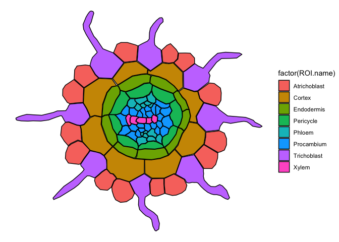
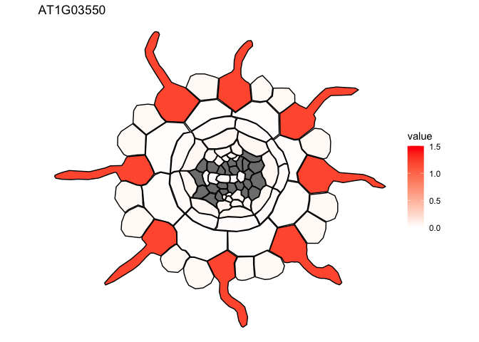
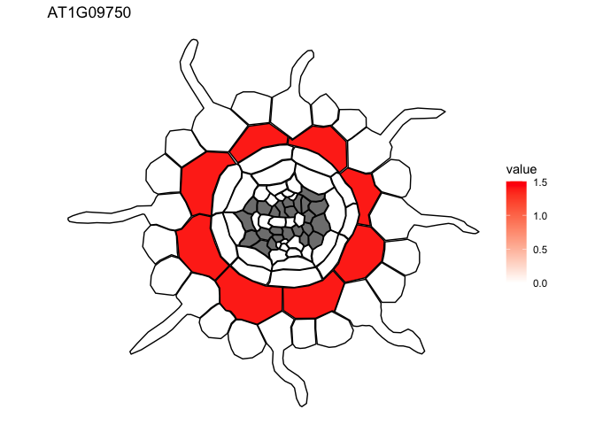
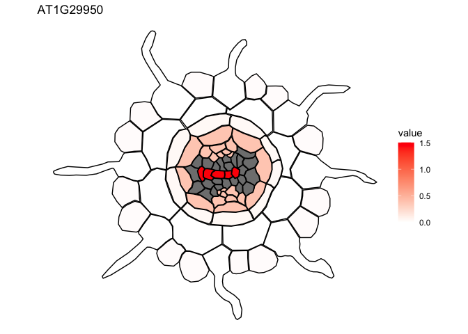
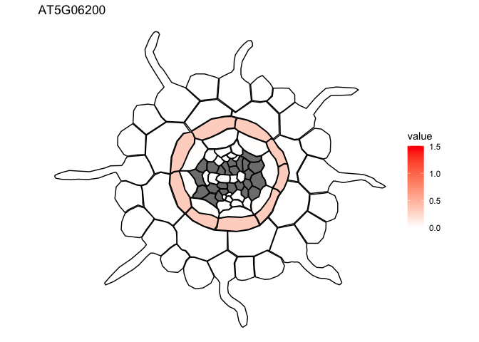

# Practical Guide on using ggPlantmap for the visualization of single-cell data

``` r
# Loading Packages
library(ggPlantmap)
library(tidyverse)
```

    ## ── Attaching core tidyverse packages ──────────────────────── tidyverse 2.0.0 ──
    ## ✔ dplyr     1.1.4     ✔ readr     2.1.4
    ## ✔ forcats   1.0.0     ✔ stringr   1.5.0
    ## ✔ ggplot2   3.4.4     ✔ tibble    3.2.1
    ## ✔ lubridate 1.9.3     ✔ tidyr     1.3.0
    ## ✔ purrr     1.0.2     
    ## ── Conflicts ────────────────────────────────────────── tidyverse_conflicts() ──
    ## ✖ dplyr::filter() masks stats::filter()
    ## ✖ dplyr::lag()    masks stats::lag()
    ## ℹ Use the conflicted package (<http://conflicted.r-lib.org/>) to force all conflicts to become errors

As you will notice, data organization is not standardized. Each study
structures their quantitative data in their own specific way. Therefore,
it is important that each specific dataset to be handle uniquely so that
can be used to feed a ggPlantmap pipeline. Here, I present an example of
a single-cell RNA-seq dataset from this paper:

<b>Denyer, T., Ma, X., Klesen, S., Scacchi, E., Nieselt, K., &
Timmermans, M. (2019). Spatiotemporal Developmental Trajectories in the
Arabidopsis Root Revealed Using High-Throughput Single-Cell RNA
Sequencing. Developmental cell, 48(6), 840–852.e5. </b>

The datasets used for this guide can be found in the data folder

## Single-cell data

The data used for this guide was extracted from [The Arabidopsis Root
scRNA-Seq
Atlas](https://www.zmbp-resources.uni-tuebingen.de/timmermans/plant-single-cell-browser-root-atlas/).
We downloaded the data that shows the expression of four genes
(AT1G03550, AT1G09750, AT1G29950 and AT5G06200) in the Arabidopsis Root
with protoplasting-induced genes dataset.

``` r
data <- read.csv("data/download_avg_UMI.csv")
print(data)
```

    ##           X   C0   C0.   C1   C1.   C2  C2.   C3   C3.   C4   C4.   C5   C5.
    ## 1 AT1G03550 0.10 11.41 0.12 11.46 0.07 7.11 0.03  4.87 0.66 74.36 0.05  8.66
    ## 2 AT1G09750 0.00  0.38 0.00  0.19 0.00 0.22 0.04  6.64 0.00  1.17 0.00  0.50
    ## 3 AT1G29950 0.05  5.13 0.04  4.08 0.06 6.47 0.34 34.96 0.01  5.36 0.38 37.38
    ## 4 AT5G06200 0.00  0.00 0.00  0.00 0.00 0.00 0.00  0.88 0.00  1.63 0.01  0.99
    ##     C6   C6.   C7   C7.   C8   C8.   C9  C9.  C10 C10.  C11  C11.  C12  C12.
    ## 1 0.04 10.03 0.02  7.46 0.04 11.51 0.02 3.23 0.02 5.20 0.01  2.74 0.10 10.49
    ## 2 0.00  1.94 0.01  1.36 0.01  1.19 0.00 0.00 0.00 0.58 1.39 75.34 0.01  1.40
    ## 3 0.02  8.74 0.03 10.85 0.01  3.97 0.03 5.91 0.04 8.67 0.00  0.68 0.26 23.78
    ## 4 0.00  0.32 0.00  1.69 0.00  1.59 0.00 1.61 0.32 2.89 0.00  0.00 0.00  0.70
    ##    C13  C13.  C14 C14.  C15  C15.  C16 C16.
    ## 1 0.02  2.19 0.01  4.0 1.19 80.65 0.06 7.69
    ## 2 0.00  0.00 0.00  0.8 0.00  0.00 0.00 0.00
    ## 3 1.48 71.53 0.03  6.4 0.00  0.00 0.03 5.13
    ## 4 0.00  0.00 0.00  1.6 0.00  0.00 0.00 0.00

The data is organized with gene names in the first column followed by
the average expression (Raw UMI reads) for all the cells in a specific
cluster (C0 to C16). Note that there is an additional column for each
cluster (example: C0.), that describes the percentage of cells in the
cluster that expresses the gene at a certain threshold. For now, we will
only focus in the average expression values.

``` r
processed.data <- data %>%
    pivot_longer(-X) %>% ## making it tidy
    filter(!str_detect(name,"[.]")) ## removing columns that correspond to the percentage of cells with signal
processed.data
```

    ## # A tibble: 68 × 3
    ##    X         name  value
    ##    <chr>     <chr> <dbl>
    ##  1 AT1G03550 C0     0.1 
    ##  2 AT1G03550 C1     0.12
    ##  3 AT1G03550 C2     0.07
    ##  4 AT1G03550 C3     0.03
    ##  5 AT1G03550 C4     0.66
    ##  6 AT1G03550 C5     0.05
    ##  7 AT1G03550 C6     0.04
    ##  8 AT1G03550 C7     0.02
    ##  9 AT1G03550 C8     0.04
    ## 10 AT1G03550 C9     0.02
    ## # ℹ 58 more rows

Now we have the data in tidy format, with only the average expression
values. But, in order to map them into a ggPlantmap, we need to refer
each cluster to a specific cell type. According to the Arabidopsis Root
with protoplasting-induced genes dataset, each cluster is annotated to a
specific cell-type based on unique molecular markers.

``` r
reference <- read.table("data/Summary of celltypes Arabidopsis Root.txt",fill=T,sep="\t",header=T)
reference
```

    ##    Cluster         Identity
    ## 1       C0 Lateral Root Cap
    ## 2       C1 Lateral Root Cap
    ## 3       C2 Lateral Root Cap
    ## 4       C3         Meristem
    ## 5       C4      Trichoblast
    ## 6       C5           Phloem
    ## 7       C5        Pericycle
    ## 8       C6     Atrichoblast
    ## 9       C7         Meristem
    ## 10      C8         Meristem
    ## 11      C9         Meristem
    ## 12     C10       Endodermis
    ## 13     C11           Cortex
    ## 14     C12        Columella
    ## 15     C13            Xylem
    ## 16     C14          Unknown
    ## 17     C15      Trichoblast
    ## 18     C16 Lateral Root Cap

This reference table was generated based on the image provided in the
[database](https://www.zmbp-resources.uni-tuebingen.de/timmermans/plant-single-cell-browser-root-atlas/cluster_lengend_1.png).
<b>We created a rough association for demonstration purposes.</b> This
is an extremely challenging part, as the distinction between clusters is
not clear in many datasets.

Ok, now we can proceed in plotting the expression values in a ggPlantmap
heatmap. We will use the pre-loaded ggPm.At.rootmatur.crossection map

``` r
ggPm.At.rootmatur.crosssection
```

    ## # A tibble: 1,113 × 5
    ##    ROI.name     ROI.id point     x     y
    ##    <chr>         <int> <int> <dbl> <dbl>
    ##  1 Atrichoblast      1     1  968. -323.
    ##  2 Atrichoblast      1     2  987. -305.
    ##  3 Atrichoblast      1     3  999. -300.
    ##  4 Atrichoblast      1     4 1019. -320.
    ##  5 Atrichoblast      1     5 1027. -332.
    ##  6 Atrichoblast      1     6 1024. -353.
    ##  7 Atrichoblast      1     7 1012. -366.
    ##  8 Atrichoblast      1     8  994. -369.
    ##  9 Atrichoblast      1     9  980. -367.
    ## 10 Atrichoblast      1    10  972. -365.
    ## # ℹ 1,103 more rows

``` r
ggPlantmap.plot(ggPm.At.rootmatur.crosssection)
```

<!-- -->

The example below show a for loop that will generate a plot for every
unique gene in the processed.data object

``` r
for  (k in unique(data$X)) {
  single.data <- processed.data %>%
    filter(X == k) %>% ## filtering for one gene
    merge(reference,by.x="name",by.y="Cluster",all.x=T) ## combining with the reference dataset for labeling clusters
  
## Merging with the ggPm.At.rootmatur.crossection using the ggPlantmap.merge() function  
final.table <- ggPlantmap.merge(ggPm.At.rootmatur.crosssection,single.data,id.x = "ROI.name",id.y="Identity")
  
## Using the ggPlantmap.heatmap to create a heatmap
plot <- ggPlantmap.heatmap(final.table,value.quant = value) + 
    scale_fill_gradient(low="white",high="red",limits=c(0,1.5)) +
    labs(title=paste0(k)) ## Title of the plot should be name of the gene
  print(plot) ## printing the plot
  ##ggsave(plot=plot,paste0(k,".png"),dpi=300) ## in case you want to save your heatmap
}
```

<!-- --><!-- --><!-- --><!-- -->
