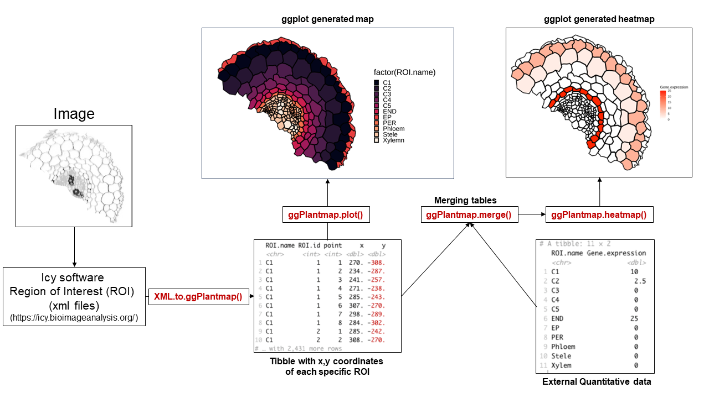
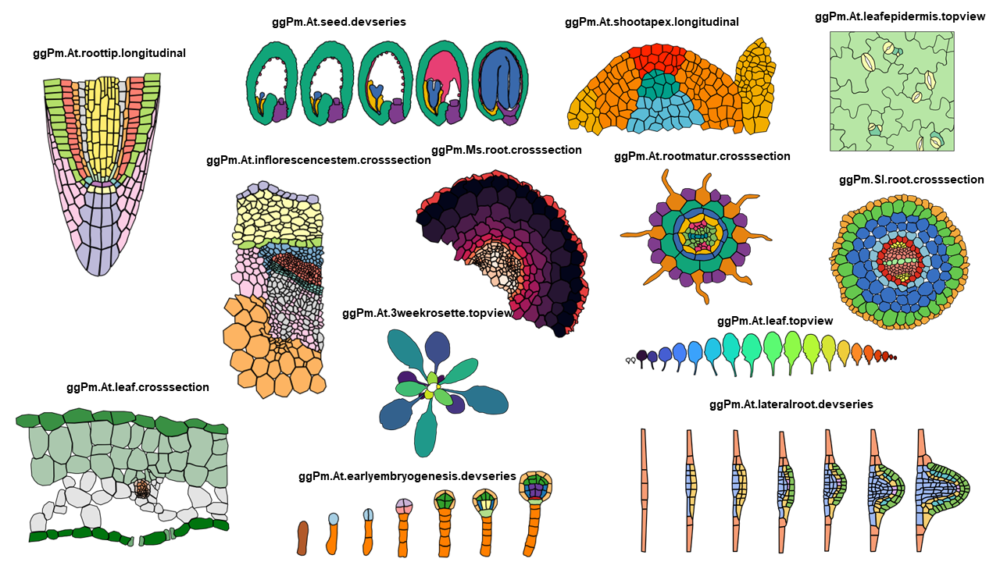
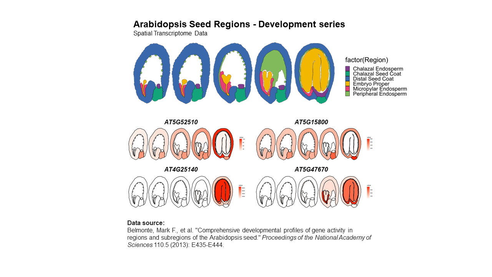
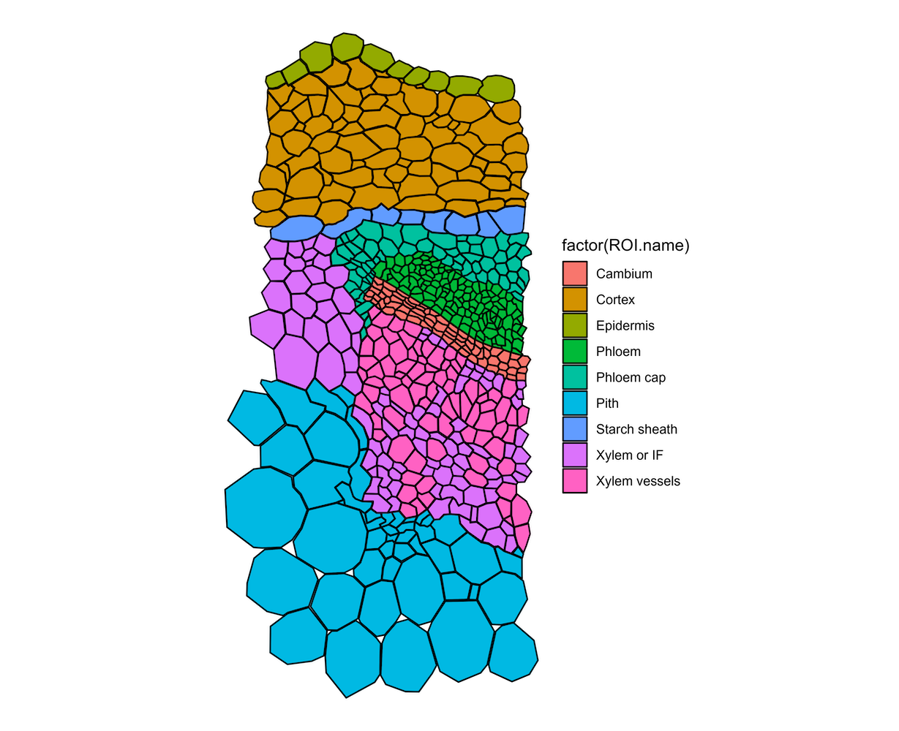
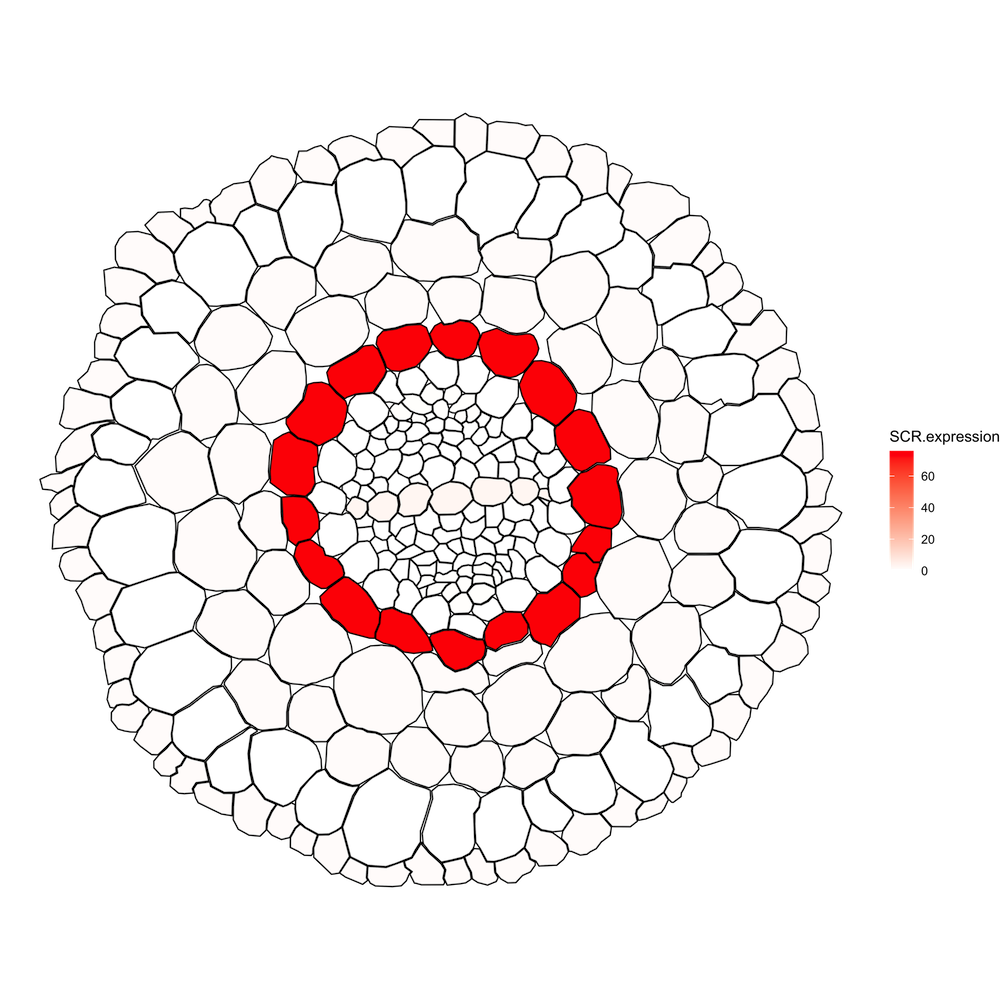

# Summary
The development of single-cell techniques revolutionized the field of plant biology. It enabled the characterization of cell-specific events and allowed us to gain novel insights of minute biological processes occurring in complex plant tissues [@cuperus_single-cell_2022; @libault_plant_2017]. Such novel approach is greatly improving our understanding of plant development, evolution, and physiology. As these techniques gain more attention within the plant research community, there is a rising need for the development of specialized visualization tools that can effectively explore the rich and complex data they produce.
`ggPlantmap` is an open-source R package with the goal of facilitating the generation of informative ggplot maps from plant images to explore quantitative cell-type specific data. When combined with external quantitative data, `ggPlantmap` can be used for the visualization and displaying of spatial profiles in distinct parts/cells of the plant (**Figure 1**). The conceptual workflow is like other ggplot based geographic map packages, such as `ggmap` [@kahle_ggmap_2013]. 



**Figure 1.** General overview of the `ggPlantmap` workflow.

Included in the package there is a set of pre-loaded maps created from previously published plant images that can be directly inserted into a ggplot coding workflow (**Table 1**, **Figure 2**). `ggPlantmap` enables users to plot heatmap signatures of gene expression or any spatial quantitative data onto plant images providing a customizable and extensible platform for visualizing, and analyzing spatial quantitative patterns within specific plant regions (**Figure 1**). This package uses the flexibility of the well-known ggplot2 R package (@wickham_ggplot2_2011) to allow users to tailor maps to their specific research questions.

**Table 1.**  List of pre-loaded maps in the package and their references

| ggPlantmap  | Species     | Tissue       | Reference    |
|--|-|-|--|
| ggPm.At.roottip.crosssection| Arabidopsis thaliana| Root| @sotta_preparing_2017 | 
| ggPm.At.roottip.longitudinal| Arabidopsis thaliana| Root| @rahni_week-long_2019 | 
| ggPm.At.3weekrosette.topview| Arabidopsis thaliana| Rosette| @nguyen_high-resolution_2015 | 
| ggPm.At.leafepidermis.topview| Arabidopsis thaliana| Leaf| @guo_spatiotemporal_2021 | 
| ggPm.At.leaf.crosssection| Arabidopsis thaliana| Leaf|@tsukaya_leaf_2013 | 
| ggPm.At.seed.devseries| Arabidopsis thaliana| Seed|@belmonte_comprehensive_2013| 
| ggPm.At.earlyembryogenesis.devseries| Arabidopsis thaliana| Embryo| @wendrich_rabidopsis_2013 | 
| ggPm.At.shootapex.longitudinal| Arabidopsis thaliana| Shoot Apex| @fuchs_aiming_2020 | 
| ggPm.At.inflorescencestem.crosssection| Arabidopsis thaliana| Stem| @shi_tissue-specific_2021 | 
| ggPm.Sl.root.crossection| Solanum lycopersicum| Root| @ron2013identification| 
| ggPm.At.leaf.topview| Arabidopsis thaliana| Leaf|@vanhaeren_journey_2015 | 
| ggPm.At.rootelong.longitudinal| Arabidopsis thaliana| Root|@shahan_single-cell_2022 | 
| ggPm.At.rootmatur.crosssection| Arabidopsis thaliana| Root|@shahan_single-cell_2022 | 
| ggPm.At.flower.diagram| Arabidopsis thaliana| Flower|@taiz_plant_2015 | 
| ggPm.At.lateralroot.devseries| Arabidopsis thaliana| Lateral Root| @torres-martinez_lateral_2019 | 
| ggPm.Ms.root.crosssection| Medicago sativa| Root| Unpublished | 



**Figure 2.** Examples of ggplots generated from pre-loaded maps. 
  
In addition to the pre-loaded maps, we documented the workflow and functions for plant researchers to create their own maps. The creation of new maps is based on the manual segmentation of plant shapes into distinct Region of Interests (ROIs) using the open-source software for image analysis Icy (@de_chaumont_icy_2012). With our described method, users can generate new maps without the necessity of high-resolution images and advanced coding skills. The `ggPlantmap` package is an open-source project, encouraging community contributions and creation of maps that will be continuously loaded into the package. We encourage users to extend its functionality to meet specific research requirements and to better display plant biological data. Its compatibility with R, one of the most comprehensive programming languages in plant biology, making it a versatile and accessible tool for the plant science community.

# Statement of need
Understanding the spatial distribution of gene expression patterns or any other quantitative data within plant tissues and cells is fundamental to understand the complex and intricate events in plant biology. The Plant eFP (Expression, Function, and Protein Localization) Browser (@winter_electronic_2007) has been an extremely valuable resource for researchers seeking to visualize gene expression data in the context of plant tissues across many different plant species (@winter_electronic_2007). Although widely used by the plant research community, the Plant eFP browser lacks open and user-friendly tools for the creation of customized expression maps independently. Plant biologists with less coding experience can often encounter challenges when attempting to incorporate their own spatial quantitative data or explore specific aspects of gene expression within plant tissues. To address this issue, we created `ggPlantmap` to allow plant researchers to create interactive ggplot maps, like the Plant eFP Browser, with minimal knowledge in the R language. In this sense, `ggPlantmap` can play an important role in the plant science toolbox by offering an open, accessible, and customizable solution for creating quantitative image maps from plant images. By providing researchers with the means to independently generate maps from plant images, we aim to empower plant scientists to explore the visualization and communication of plant research in creative and exciting ways. We hope that ggPlantmap can assist the plant science community, fostering innovation and improving our understanding of plant development and function.



**Figure 3.** Example of a gene expression heatmap generated using `ggPlantmap`. Data source: @belmonte_comprehensive_2013
 
# Functionality
The package is available on GitHub under the MIT License at https://github.com/leonardojo/ggPlantmap. We also created a detailed user guide through all the available functionality of `ggPlantmap`. We also created a [walkthrough document](https://github.com/leonardojo/ggPlantmap/blob/main/TutorialforXMLfile.pdf) to guide users on creating their own map using `ggPlantmap`. We hope to keep updating the catalog of pre-loaded maps in the package with the help of the plant research community. To this end, we also provided [instructions](https://github.com/leonardojo/ggPlantmap/blob/main/contributetoggPlantmap.md) to guide users to submit their own map creations into the package.

```r
## Installing devtools
install.packages("devtools")
library(devtools)
```

```r
## Installing ggPlantmap
install_github("leonardojo/ggPlantmap")
library(ggPlantmap)
```

##	- Pre-loaded maps
```r
library(ggPlantmap)
ggPm.summary$ggPlantmap.name
##  [1] "ggPm.At.roottip.crosssection"          
##  [2] "ggPm.At.roottip.longitudinal"          
##  [3] "ggPm.At.3weekrosette.topview"          
##  [4] "ggPm.At.leafepidermis.topview"         
##  [5] "ggPm.At.leaf.crosssection"             
##  [6] "ggPm.At.seed.devseries"                
##  [7] "ggPm.At.earlyembryogenesis.devseries"  
##  [8] "ggPm.At.shootapex.longitudinal"        
##  [9] "ggPm.At.inflorescencestem.crosssection"
## [10] "ggPm.Sl.root.crosssection"             
## [11] "ggPm.At.leaf.topview"                  
## [12] "ggPm.At.rootelong.longitudinal"        
## [13] "ggPm.At.rootmatur.crosssection"        
## [14] "ggPm.At.flower.diagram"                
## [15] "ggPm.At.lateralroot.devseries"         
## [16] "ggPm.Ms.root.crosssection"
```

## - ggPlantmap.plot()
Creating a ggPlantmap ggplot
```r
library(ggPlantmap)
ggPlantmap.plot(ggPm.At.inflorescencestem.crosssection,ROI.name)
```



**Figure 4.** Map plotted from ggPm.At.inflorescencestem.crosssection. The column ROI.name was used to color map the map.

##	- ggPlantmap.merge()
Combining a map with external quantitative data
```r
library(ggPlantmap)
## Expression sample data
ggPm.tomatoatlas.expression.sample
```

```r
## Combining with the tomato root ggPlantmap
ggPlantmap.merge(ggPm.Sl.root.crosssection,
                 ggPm.tomatoatlas.expression.sample,
                 id.x="ROI.name","Cell.layer")
```

##	- ggPlantmap.heatmap()
```r
library(ggPlantmap)
library(ggplot2)

## Combining with the tomato root ggPlantmap
ggPlantmap.expression <- ggPlantmap.merge(ggPm.Sl.root.crosssection,
                                          ggPm.tomatoatlas.expression.sample,
                                          id.x="ROI.name","Cell.layer")
ggPlantmap.heatmap(ggPlantmap.expression,SCR.expression) +
  scale_fill_gradient(low="white",high="red",na.value="white")
```



**Figure 5.** Sample for ggPlantmap heatmap. Expression of tomato SCARECROW (SCR) in distinct cell types of the tomato root. Data source:  @kajala_innovation_2021.

# Acknowledgements
We thank Kyra van der Velde, Lisa Oskam, Monica Garcia Gomez and Pierre Gautrat for suggestions and trials of the initial versions of the package. We also would like to acknowledge Andres Romanowski for providing some data for the initial tests of ggPlantmap. This work was funded by the NWO VIDI grant number VI.Vidi.193.104 to K.K.

# References